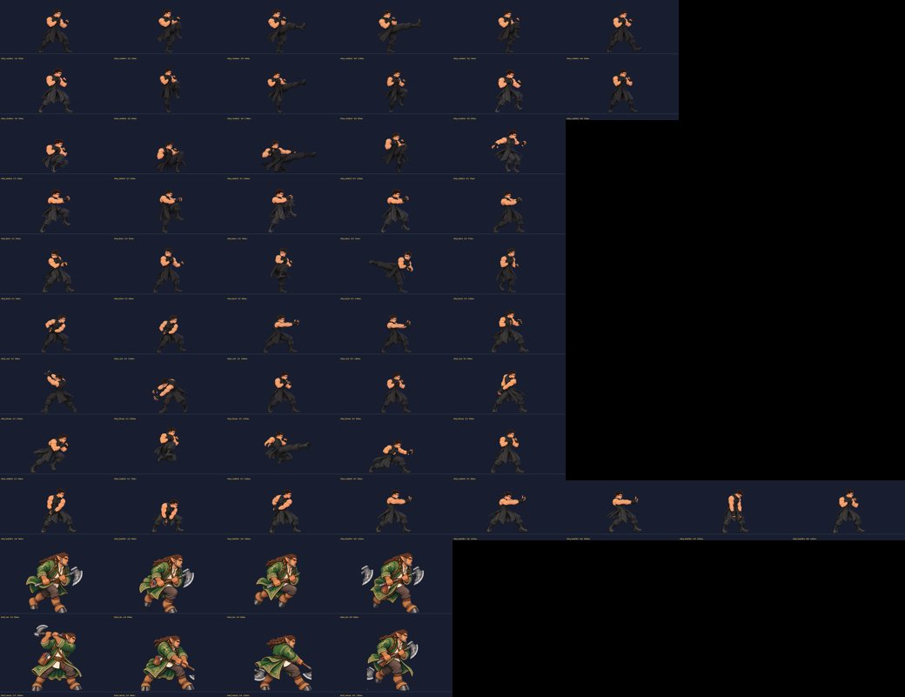
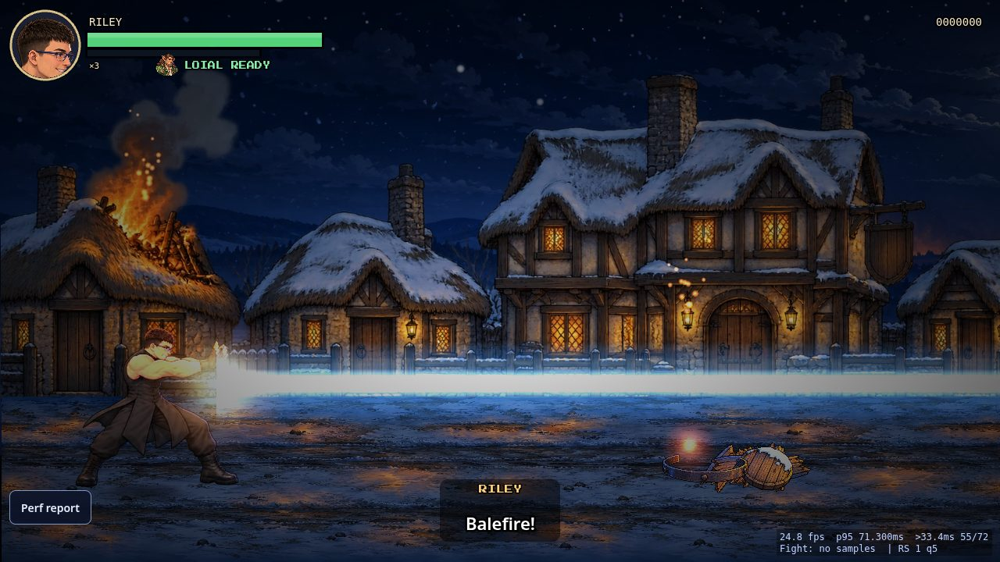
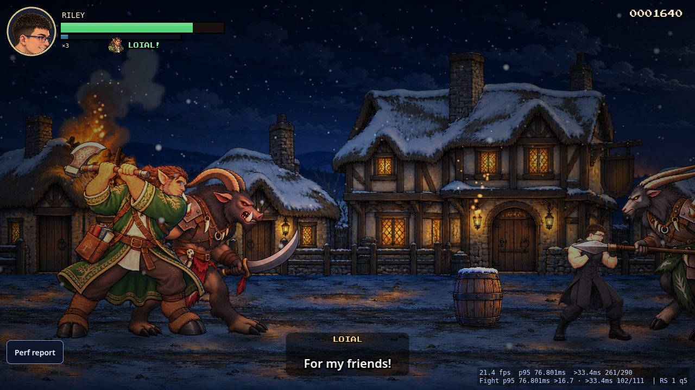
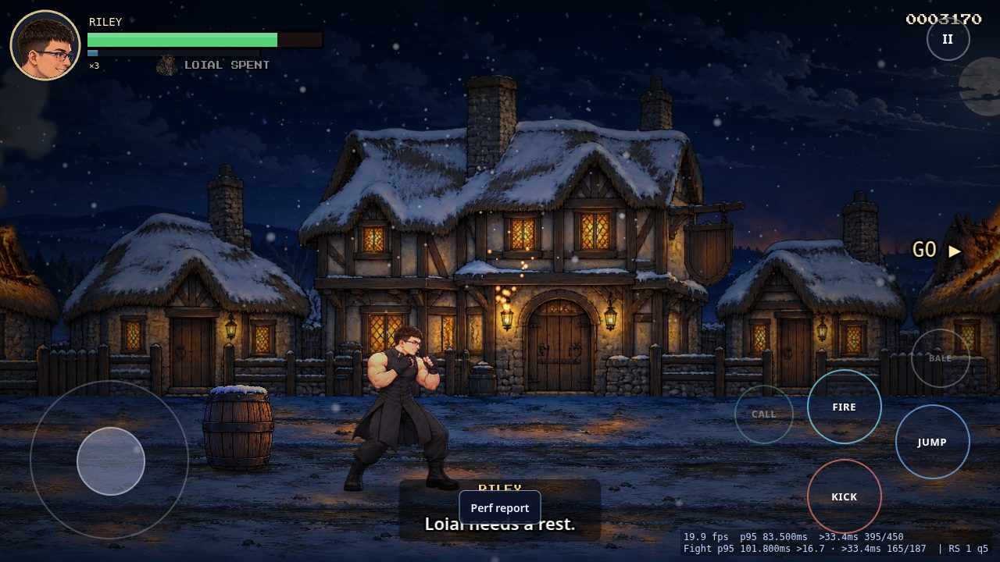
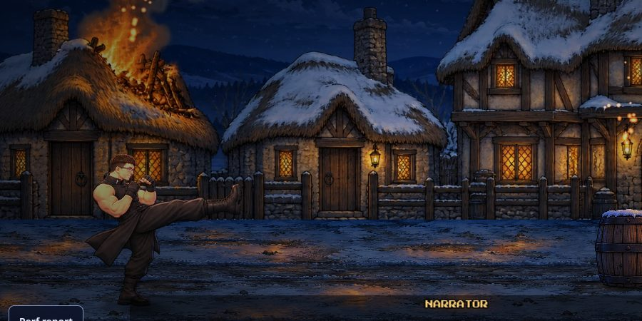
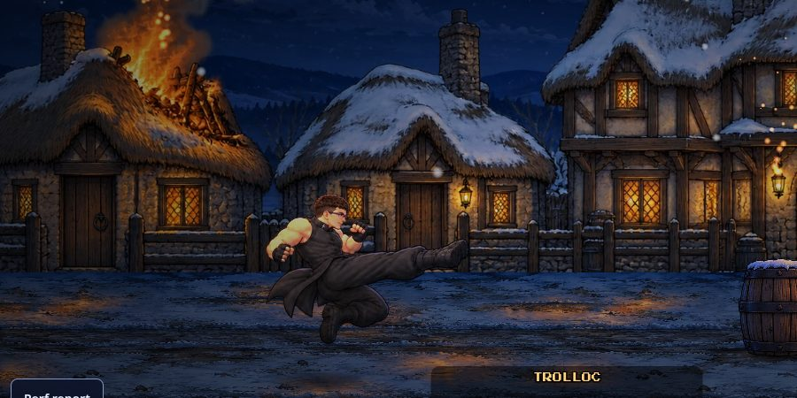
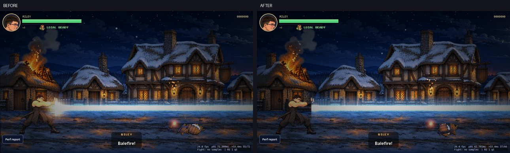
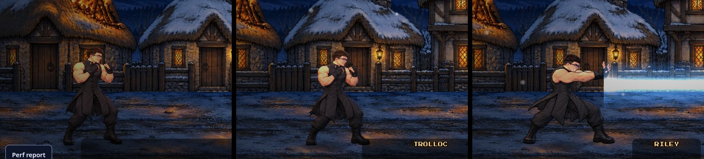
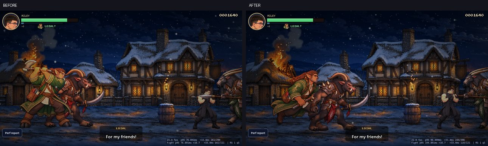
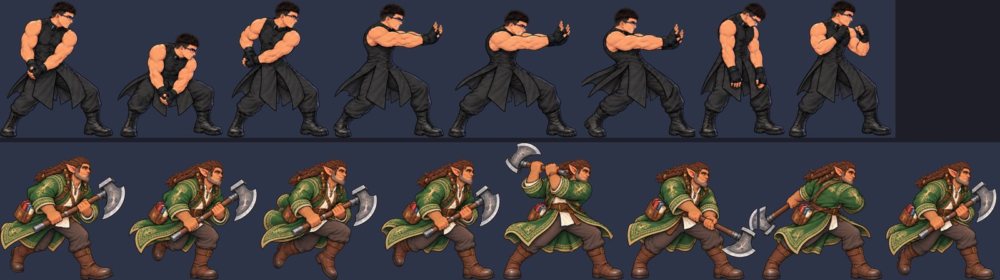

# Balefire + Loial restored from 1.1, and more Riley frames

Restore point for 1.1: tag `v1.1-live-8a17bcd`. 1.1 sources: `js/scenes.js` (`activateBalefire`, `callLoial`), `js/allies.js` (Loial).

## Balefire (special)
- F / B, controller B (button 1), touch **BALE** (dimmed until the meter is full).
- Needs a **full** saidin meter (100) and spends all of it, as in 1.1. Riley is invulnerable for 1.5 s (1.1 value).
- 8-frame `riley_balefire` animation; on the thrust frame a white-hot beam (additive core + blue glow + flare) runs from his hands to the screen edge with two dynamic scene lights riding it. It is held through the sustain frames and fades on the release frame.
- Every foe in front is struck once (normal foes: max HP + 10, so they're destroyed, like 1.1; boss: 80, scaled only by his own armor/stun rules). Barrels in front break.
- HUD: the saidin bar flashes white with **BALEFIRE READY** when full.
- Voice `riley_super_01` "Balefire!" and the 1.1 `balefire` sfx recipe.

## Loial (ally assist)
- R / V / U / I, controller LB (button 4), touch **CALL**. Run on the controller is now RB only.
- Once per stage (`LOIAL READY` → `LOIAL!` → `LOIAL SPENT` beside the saidin bar, with his portrait; the CALL button dims when spent).
- Charges in from the left edge, steers to the nearest foe, makes up to two axe sweeps, bowls over anyone he runs into, and leaves off the right edge after ~3.6 s. Damage from 1.1 normal difficulty: 44, boss 18. He can't be hit.
- Voices (same Kokoro files as 1.1): "Loial, now!", "For my friends!", "That should help!", and "Loial needs a rest." when spent; 1.1 horn sfx.

## Art (ChatGPT image gen via Codex, jfeldman9@gmail.com)
1.1's Loial was a single painted still (`cg-loial.png`) and did not fit the 2.0 sprite style, so it was used only as an identity reference. New sheets were generated in the 2.0 house style. Frames were sliced by connected components (pixels copied), then registered with uniform scale + translation only (`build_anim2.py`, which lets one animation take frames from several sheets). Nothing was blurred, recoloured, interpolated or mirrored; the only flip is the existing facing flip at runtime.

| Sheet | Used for |
|---|---|
| kick review candidate 1 (`yetti-pkg/review-candidates`) | `riley_combo1`: 6-frame front kick (was a 3-frame jab) |
| `riley-fill-a` | combo2 anticipation + return; airkick wind-up + landing; knee pull-down, peak, drop |
| `riley-fill-b` | new `riley_runkick` (5 frames, was a reuse of combo2); back-kick anticipation; cast recovery; throw follow-through |
| `riley-balefire` | `riley_balefire` (8) |
| `loial` | `loial_run` (4, loop) + `loial_sweep` (4); HUD portrait |

Riley: 72 → 98 named frames (target 150 still open). Every shipped attack now has at least 5 frames:
combo1 6, combo2 6, combo3 8, back 5, airkick 5, runkick 5, cast 5, knee 5, throw 5 (+ balefire 8).

## Perf (same box, SwiftShader software GL, `?skip=boss&demo=1`, default quality, 30 s, alternating)
| build | fps (3 runs) | frames >33 ms |
|---|---|---|
| before 326faff | 20.79 / 21.26 / 21.98 (avg 21.3) | 98.1 / 98.0 / 97.1 % |
| after | 21.11 / 22.08 / 22.22 (avg 21.8) | 96.8 / 97.6 / 95.7 % |

Moment checks (new build, open field after Start): balefire 2 s window 26.2 / 27.5 fps vs 28.7 / 28.1 without; Loial 4 s window 24.5 / 23.0 vs 25.9 / 24.8 without. SwiftShader numbers are relative only, not device numbers.

## Repaint (Jason, Oct 2 10:48 PM PT)
- **Riley balefire, 8 frames** repainted with ChatGPT image gen via Codex (jfeldman9@gmail.com), from `riley.jpg`, the Riley master and model sheet and the combo frames as references: short dark hair, thin blue-framed glasses, sleeveless black Asha'man coat, 16 and very muscular. Sheet `gen/riley-balefire2/balefire-sheet2.png`, cut into `frames/raw/riley_balefire2`. Checked each frame side by side against the combo frames.
- **The in-game wash-out was partly the effect.** The old 1.6x additive muzzle flare sat over Riley and turned his black coat grey-brown. Now the flare is small (0.5x) and just ahead of his palms, and the two beam lights sit ahead of him on the beam (at least 300 px out, intensity 1.5). With the beam on, he keeps his black coat in the same lighting as idle.
- **Loial with boots.** Run and sweep (8 frames) come from a new sheet with knee-high brown leather boots and no hooves (`gen/loial2/loial-sheet2-try2.png`, from the new locked master `master-side2.png`). Two stray pieces were reassigned by hand to the figure they belong to (see `slices.json` `hand_fixes`). The HUD portrait was regenerated with tufted ears and hanging eyebrows (`gen/loial-portrait2/loial-portrait2.png`).
- The Codex job for the third Loial sheet try hung when the box stalled. I killed it and kept the second try. Both tries are in `gen/loial2/`.

Perf after the repaint (same box, SwiftShader, `?skip=boss&demo=1`, 30 s, alternating): before 326faff 21.67 / 23.23 / 21.01 fps (avg 22.0), after 21.91 / 20.99 / 20.82 (avg 21.2). That is within run-to-run noise on this box. Moments: balefire 2 s window 25.3 / 28.9 fps vs 28.5 / 30.1 without; Loial 4 s window 26.9 / 25.4 vs 29.8 / 27.4 without.
