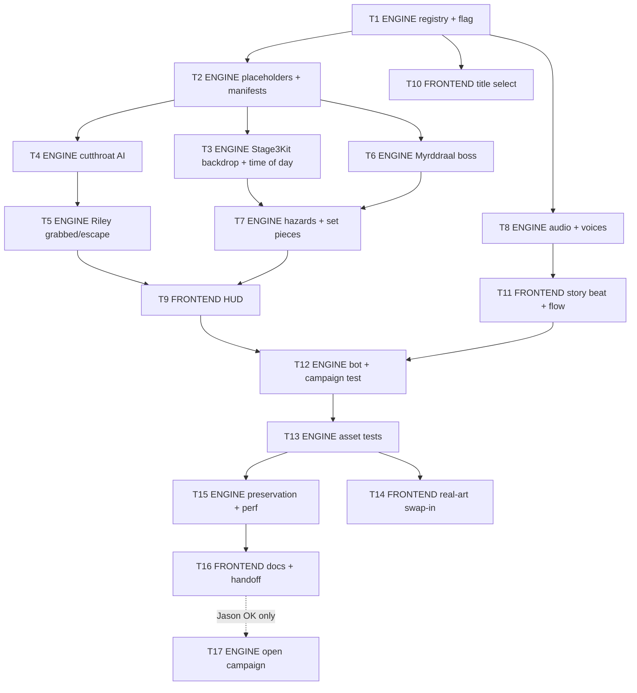

# Stage 3 plan: Caemlyn and the Myrddraal

*Planner: Claude Opus 5.5, Sat Oct 3 2026. Branch `rwb-2-stage3-ag`, based on `rwb-2-stage2` @ `ae700b1`.
Baseline: `node --test tests/*.test.mjs` = **322/322 passing** at `ae700b1`.*

This is a plan only. It contains no game code; code snippets below are specifications for the builders.

---

## 0. Ground rules (apply to every task)

1. **Branches.** Never touch `main`. Never push to `rwb-w2`. Commit only on `rwb-2-stage3-ag`. Jason approves every merge.
2. **Tests.** Never loosen, skip or delete a test. Every new system ships with tests in the same commit. Before every
   commit, run `node --test tests/*.test.mjs`. The count must be ≥ 322 plus every test added so far, with 0 failures.
3. **Stage 1 and Stage 2 behaviour is frozen.** After every ENGINE task:
   - `node tests/helpers/run-full-stage-simulations.mjs > /tmp/sim.json`, then diff the output against
     `docs/stage1/evidence/full-stage-simulation.json`. It must match exactly.
   - `node tools/audit-stage1.mjs` must pass.
   - `tests/stage2-*.test.mjs` must stay green and unedited.
4. **Stage 3 stays behind a flag until Jason says otherwise** (see §2.1). Four existing assertions pin the 2-stage
   game (§2.1 lists them). The flag keeps them true, so no existing test is edited. Opening Stage 3 to the campaign is
   task **T17**, and it needs Jason's explicit OK.
5. **Art.** Use **labelled placeholders only** until real art arrives. Placeholders are flat cards at the final size
   and frame layout, with the filename and frame number written on them, made by a script (precedent:
   `tools/make-power-placeholders.py`).
   - No generated or fake art from the builders.
   - No recolouring, blurring, stretching, interpolating or mirroring existing sprites into "new" frames. Flipping a
     sprite to face the other way is fine.
   - Real art comes only from ChatGPT images (preferred) or Gemini. Never Grok for stills. No paid usage. No Seedance
     or Manus.
6. **Riley stays on-model:** 16, very muscular, short dark hair, thin blue-framed glasses, sleeveless black Asha'man
   coat. Never a kid.
7. **Kid-safe:** no gore.
   - Darkfriends are knocked out (stars) or run away, like the Whitecloaks.
   - The Myrddraal melts back into shadow.
   - Twinkle Toes is only implied: a ribbon, a small bundle, never the child in peril.

---

## 1. Stage 3 design (from `plan/LEVELS.md` row 3)

**Caemlyn**: royal city walls, the Queen's Blessing inn, a rooftop chase, the palace garden.
- **New enemy:** Darkfriend cutthroat (grabber).
- **Boss:** Myrddraal.
  - Phase 1: shadow blink.
  - Phase 2: fear aura that dims the screen edges.
  - Phase 3: splits into 2 shadow copies. Parry (counter) the real one.
- **Light:** golden afternoon at the start of the stage, torchlit night by the boss.

### 1.1 Story beat (between Stage 2 and Stage 3; 3 painted panels, 6 lines)

The Fade's trail leads to Caemlyn. At the Queen's Blessing, the innkeeper Basel Gill whispers that a man with no eyes
was seen on the rooftops at dusk, carrying "a small bundle with a blue ribbon". Riley goes up onto the roofs as the
sun sets. The ribbon is the only sign of Twinkle Toes. She is never shown.

### 1.2 Layout (world 5200 px, 4 zones, same shape as Stages 1 and 2; about 3–3.5 min for the bot)

| Zone | Place (plate) | Light | Waves | Set piece |
|---|---|---|---|---|
| 0 (`at` 260, 0–1280) | New City market street under the great white walls (`bg3-mid`, left half) | Golden afternoon | `[cutthroat R 0, cutthroat L 1.2]`, then `[zealot R 0, cutthroat L 0.8]` | Intro bark: a cutthroat says *"That's the one the Lady wants. Take him quiet."* Whitecloaks still preach in Caemlyn, which is canon, so the returning zealot fits. |
| 1 (`at` 1500, 1240–2520) | Queen's Blessing inn yard (`bg3-mid`, right half) | Late afternoon | `[cutthroat R 0, archer R 0.6]`, then `[cutthroat L 0, cutthroat R 0.5, zealot R 2.0]` | **Ribbon** drops in wave 0 (+1000). Gill's line plays on zone entry. |
| 2 (`at` 2800, 2560–3840) | **Rooftops at sunset** (`bg3-mid2`, left half) | Sunset to dusk; torches start to light | `[cutthroat T 0, cutthroat T 0.9]`, then `[hound R 0, cutthroat T 0.6, cutthroat L 1.4]` | **Sliding roof tiles** sweep whole lane bands. Cutthroats **drop in from above** (spawn side `T`). On zone clear, the Fade is **glimpsed leaping across the far roofs** with the bundle. |
| 3 (`at` 4140, 3920–5200) | **Royal Palace garden at night** (`bg3-mid2`, right half) | Torchlit night | Boss | The Myrddraal steps out of a hedge shadow. Garden torches are the main lights. |

**Drops** use the same table system as Stages 1 and 2:

| Zone | Wave | Kind | Delay (s) |
|---|---|---|---|
| 0 | 0 | angreal | 1.2 |
| 0 | 1 | lightning | 1.0 |
| 1 | 0 | fireshield | 1.0 |
| 1 | 1 | airwhip | 1.2 |
| 2 | 0 | `ter?` | 1.0 |
| 2 | 1 | angreal | 1.0 |

The boss drop is the **sa'angreal at phase 2**. Balefire and the Loial call work unchanged. Crates reuse Stage 2's
`prop-crate` and `planks` art unchanged (shared, not recoloured).

### 1.3 Darkfriend cutthroat (`cutthroat`, grabber, 34 HP)

- **Role:** a flanker that tries to get **behind** Riley, using the flank logic of `TYPES.hound`. There is a light
  cosh swing (`slash`, 5 frames, 8 dmg, `medium`) and a **grab lunge**.
- **Grab lunge**
  - **Telegraph:** a crouched coil (`lunge` frame 0) for **0.45 s**, plus a glint and a `hiss` sting. 0.45 s is
    deliberately longer than Byar's 0.22 s rush wind-up, which the Stage 2 review flagged as too short (S2).
  - **The lunge:** 620 px/s for at most 0.45 s along his lane.
  - **When it catches Riley:** only if Riley is grounded (`z == 0`) and in `idle`, `walk`, `run`, `hurt` or `land`,
    or attacking *away* from him. If Riley is facing him with an active attack frame, the cutthroat is hit instead,
    which counts as a counter.
- **Hold.** Riley enters the new `grabbed` state with the cutthroat locked behind him.
  - Riley takes chip damage of 2 every 0.6 s, for up to **2.4 s**.
  - **Mash to escape.** Every press of attack, jump or special, and every new direction, adds 1. Riley needs **6**,
    and the count decays by 1 every 0.5 s.
  - **On escape:** Riley elbows and shoves him (`escape` anim). The cutthroat is `shoved`: open for 1.2 s and taking
    ×1.3 damage.
  - **On timeout:** he throws Riley down (8 dmg, knockdown).
- **Fairness**
  - Only **one cutthroat may be grabbing** at a time (`grabBusy`, the same pattern as `archerBusy`).
  - Grab cooldown is 5–8 s.
  - While Riley is grabbed, other enemies cannot hit him and do not take attack tokens. The grabber holds the only
    token.
  - Calling Loial while grabbed knocks the cutthroat off.
  - Hazards (roof tiles) still hit both Riley and the grabber, and break the hold.
- **Drop-in (`T` side):** a shadow marker grows on the ground for 0.7 s, then he lands from `z = 520`. He can't be
  hit until he lands.
- **Kid-safe KO:** reuses the Whitecloak KO/flee alternation (stars, or he gets up and runs).

### 1.4 Boss: the Myrddraal (`fade`, 440 HP, 3 phases)

Theatrical villain: eyeless, pale, a black cloak that hangs unnaturally still. It is never killed on screen; it
**melts back into shadow**.

1. **Shadow blink (100–66%)**
   - Two-hit sword string (`slash`, 6 frames) and a lunge (`lunge`, 5 frames).
   - Every 4–6 s it sinks into shadow (`blinkout`, 4 frames). A **shadow pool telegraph** grows for **0.6 s** at a spot
     just behind Riley. It rises there (`blinkin`, 4 frames) and slashes.
   - **Counter:** hit it during `blinkin` frames 2–3 and it **staggers** for 1.4 s, taking ×1.5 damage
     (`COUNTER!`).
2. **Fear aura (66–33%)**
   - It raises its hand (`fear`, 5 frames). From then on it radiates an aura with a radius of 300 px.
   - While Riley stands inside the aura, a fear meter fills over 1.4 s. When the meter is full, Riley is **shaken**
     for 0.7 s, using his existing `hurt` frames (no new art).
   - The camera vignette deepens from 0.35 to 0.75 strength, and the garden torches dim to 70% radius. This is the
     "screen edges dim" from LEVELS.md.
   - **Light beats shadow:** any fire or light power that lands within 400 px clears the aura for 4 s and snaps the
     vignette back. That means a fireball, lightning, fire shield or Balefire. This teaches the Stage 5 (Ways) rule
     early.
   - Blinks continue, at a slower rate (6–8 s).
3. **Shadow copies (33–0%)**
   - It splits (`split`, 5 frames) into **itself plus 2 copies** around Riley. The copies use the **same painted
     frames, with no tint or recolour**.
   - **Tell:** the real one has a ground shadow, is lit by the torches, and its blade glints white on the lunge
     telegraph. The copies cast no shadow and trail shadow wisps (particles) at their feet.
   - All three wind up lunges in a staggered order.
   - **Hitting a copy:** it bursts into shadow smoke (`fx-shadowburst`). The real one lunges within 0.3 s.
   - **Hitting the real one during its telegraph or active frames is the "parry":** a 1.4 s stagger at ×1.5 damage,
     and every copy vanishes. It re-splits after 8–10 s.
   - Riley has **no new parry button**. The parry is a counter-hit timed against the telegraph. A true Spirit-ward
     parry (PLAN.md §5.2) is a Riley-wide moveset change; see open question Q1.
- **Damage reduction:** ×0.6 while blinking, casting fear, splitting, during its intro, or just after getting up.
  This matches Byar.
- **Defeat:** it staggers, kneels and melts into shadow (`defeated`, 4 frames). Line: *"The shadow... remembers..."*
  Riley: *"Remember this, then."* It is never "killed".

### 1.5 Golden afternoon → torchlit night

This is a new, data-driven **time-of-day** system, a pure function of camera x:

```
timeOfDay(camX) -> { t: 0..1, ambient, farMix, sunI, torchK }
```

- **`ambient`** lerps between the keyframes in `assets/bg3/lights.json` (`timeKeys`). For example:
  - x 0: `0x8a7a62` (warm afternoon)
  - x 2400: `0x7a5a52` (sunset)
  - x 3300: `0x3a3a58` (dusk)
  - x 4000: `0x262c48` (night)
- **`farMix`** cross-fades `bg3-far-day` into `bg3-far-night`. Both are separately painted plates; there is no
  recolouring.
- **`sunI`** fades a large warm "sun" light, low on the upper left, from its full intensity down to 0. It is a
  world-space light held at a fixed screen position, like `placeMoon`.
- **`torchK`:** each torch in `lights.json` has a `litAt` value of `t`. Torches ignite (an 0.4 s ramp plus a
  flare-up) as the day passes. At most 4 torches are lit on screen at once (`capOnScreen`, through `placeFires`).
- **Atmosphere:** dust motes in sunbeams during the day, moths and drifting embers at night. The front layer is
  `s.snowFront`, so the quality governor thins it.

---

## 2. Architecture decisions

### 2.1 Stage 3 is behind a flag (no existing test edited)

Four existing assertions pin the current 2-stage game:

| # | Assertion |
|---|---|
| 1 | `tests/stage2-flow.test.mjs:18`: `stageFromQuery('stage=3') === 1` |
| 2 | `tests/stage2-flow.test.mjs:65`: Stage 2 clear restarts with `{ stage: 1 }` |
| 3 | `tests/stage2-campaign.test.mjs:65`: Stage 2 clear restarts with `{ stage: 1 }` |
| 4 | `tests/stage2-flow.test.mjs:73-76`: title select clamps at stage 2 (`[2, 1, 2]`) |

So Stage 3 is enabled only when the URL has **`s3=1`**:

- `?stage=3&s3=1` jumps to Stage 3. `?stage=3` alone still resolves to Stage 1, so assertion 1 still holds.
- With `s3=1`, title select offers STAGE 3 and Stage 2 clear restarts into `{ stage: 3, fromStage2: true, autostart: true }`.
  Without it, both stay exactly as today.
- The flag survives `scene.restart` because `q` is read from the URL.

**T17** removes the flag and rewrites those four assertions into stricter 3-stage versions. That only happens after
Jason's explicit OK, because it changes Stage 2's asserted ending.

### 2.2 The stage registry replaces `this.kit ⇒ Stage 2`

Today `src/stage1.js` treats "has a kit" as "is Stage 2". The places that do this are lines 63, 68–71, 88–89, 96, 112,
120, 149, 195, 213, 231, 240, 271, 274, 279, 289, 320, plus `hud.js:239-240`. **T1** replaces them with one registry
(`STAGES[n]`) that holds, per stage:

- `zones`, `drops`, `bossDrop`, `ribbon`, `crates`
- `skipBoss`, `boss {type, name, portrait}`
- `loading`, `kit` class, `queue(scene)`, `textures`, `chars`
- `music`
- `onBossPhase` / `bossDown` voice schedule

Stage 1's entry wraps the **existing** constants (`ZONES`, `DROPS`, `BOSS_DROP`, `BARRELS`, and the Chieftain
schedule) by reference. Its numbers do not move.

### 2.3 The Kit interface

`Stage2Kit` already defines this interface. `Stage3Kit` implements the same methods, and T1 documents them in
`src/stages.js`:

- **Lifecycle:** `ambient`, `ambientUnlit`, `build()`, `start()`, `destroy()`, `update(dt)`.
- **Zones:** `onZoneClear(i)`.
- **Hazards:** `clearHazards()`, `threats()`.
- **Ribbon:** `dropRibbon()`, `collectRibbon(p)`, `ribbons`.
- **Enemy hooks:** `koStars(e)`, `telegraph(e)`, `glint()`, `hint()`.
- **Stats:** `stats`.
- **Optional:** `claimMudJoke` (Stage 2 only; callers already use `?.`).

### 2.4 Assets: Stage 3 owns its own keys; boot is unchanged

- Stage 3's `anims.json` files (`cutthroat`, `fade`, `riley3`) load in **Stage 3's preload**, not in `ALL_CHARS` at
  boot. That keeps Stage 1 and Stage 2 boot traffic byte-identical.
- Riley's new frames (`grabbed`, `escape`) go in a **separate atlas key `riley3`**, with animation names
  `riley_grabbed` and `riley_escape`. `assets/chars/riley.anims.json` and `riley-0` / `riley-1` are not touched.
- `releaseStage(n)` is generalised: when stage *k* loads, every other stage's textures and characters are released,
  except those shared with *k*.

### 2.5 Light budget

`maxLights` is 10 (`main.js:19`). Stage 3 worst case, Fade phase 2–3 in the garden:

| Light | Count |
|---|---|
| Hero | 1 |
| Garden torches (cap) | 4 |
| Fireball | 1 |
| Pickup | 1 |
| Ribbon | 1 |
| Power (lightning or fire shield) | 1 |
| **Total** | **9 ≤ 10** |

- The fear aura **dims existing lights**; it never adds lights.
- Shadow pools and copies are unlit sprites.
- The sun light is off at night (`sunI` = 0, and it is removed when it reaches 0).
- A test asserts this worst case (T7).

---

## 3. Tasks (in order)

Tags: **ENGINE** = logic, data, systems, tools, tests. **FRONTEND** = what the player sees and touches: HUD, title,
story beat, art integration, docs.

Every task ends with the full `node --test tests/*.test.mjs` run and the Stage 1 evidence diff plus audit from §0.3.



Parallel lanes after T2: **A** (T3 → T7), **B** (T4 → T5), **C** (T6), **D** (T8, T10). They join at T9/T11.

---

### T1 · ENGINE · Stage registry and the `s3` flag (refactor; no behaviour change)

**Files**
- `src/stages.js`
  - Add `STAGES` and `stageEnabled(n, q)`.
  - Change `STAGE_COUNT` to a function `maxStage(q)` that returns 2 or 3, and keep `STAGE_COUNT = 2` exported for old
    callers.
  - `stageFromQuery` returns 3 only when `q.get('s3') === '1'`.
  - Add `resolveStage` support for `data.stage === 3` with the same flag.
  - Add the Kit interface doc comment.
  - Add `STAGE_CHARS[3] = ['riley', 'riley3', 'cutthroat', 'zealot', 'archer', 'hound', 'fade', 'loial']`.
  - Add a `STAGE3` data stub with zones, drops and the rest of §1.2. Wave entries may reference only existing types
    until T4 lands.
- `src/stage2.js`
  - Move `STAGE_TEXTURES` to a registry-friendly shape: keep the export and add `3`, with `crate` and `planks` marked
    shared between stages 2 and 3.
- `src/stage1.js`
  - Replace every `this.kit` / `stageNo === 2` stage switch (§2.2) with `this.stageDef = STAGES[this.stageNo]`.
  - Generalise `releaseStage`.
  - `selectStage` clamps at `maxStage(q)`.
  - The clear-card restart target becomes `stageDef.next(q)`. For Stage 2 that is `{ stage: 1 }` without the flag.
- `src/music.js`
  - Add `STAGE_MUSIC[3] = { stage: 'stage3', boss: 'boss3' }`.
  - Until T8, `audio.js` maps those ids to the existing `stage2` / `boss2` files, recorded as placeholders in
    `tools/music/music-manifest.json`.

**Acceptance tests**
- All 322 existing tests pass, unedited.
- Stage 1 evidence is identical and the audit passes.
- New `tests/stage-registry.test.mjs`:
  1. `STAGES[1]` and `STAGES[2]` zones, drops, bossDrop, crates, skipBoss, chars and textures **deep-equal frozen
     literal snapshots** copied from `ae700b1`.
  2. `stageFromQuery`:
     - `stage=3` → 1
     - `stage=3&s3=1` → 3
     - `stage=4&s3=1` → 1
     - `stage=2&s3=1` → 2
  3. `resolveStage({stage:3}, Q(''))` → 1, and `resolveStage({stage:3}, Q('s3=1'))` → 3.
  4. `maxStage(Q(''))` → 2, and `maxStage(Q('s3=1'))` → 3.
  5. Releasing: loading 3 after 2 releases only Stage 2's non-shared keys (`crate`, `planks`, `zealot`, `archer`,
     `hound`, `riley`, `loial` stay). Loading 1 after 3 releases every Stage 3 key.
  6. The flag-on clear target for Stage 2 is `{ stage: 3, fromStage2: true, autostart: true }`. Flag-off stays
     `{ stage: 1 }`.

**Order:** first. Every other task depends on it.

### T2 · ENGINE · Labelled placeholder generator and Stage 3 manifests

**Files**
- `tools/stage3/make_placeholders.py` (new). It is modelled on `tools/make-power-placeholders.py` and reads
  `tools/stage3/art-manifest.json`. For every entry in the ART LIST (§4), it writes:
  - **Characters:** packed atlas pages with `.webp`, a flat-normal `_n` (RGB 128,128,255), and `_nl`, plus `.json`
    and `<key>.anims.json`.
    - Canvas, baseline and scale come from §4.
    - Each frame is a grey card with a dashed silhouette box sized to the character, a baseline line at the anchor,
      and the text `PLACEHOLDER <key>_<anim>_<nn>`.
    - Holds are timed placeholders, ≥ 90 ms.
    - Every `anims.json` gets `"placeholder": true`.
  - **Plates, props, FX and panels:** flat cards at the final pixel size and frame layout, labelled with their filename.
  - **Status file:** `assets/stage3/ART_STATUS.json`, listing every file as `{ file, placeholder: true, prompt: "docs/stage3/prompts/<id>.json" }`.
- `tools/stage3/art-manifest.json` (new). It is the machine-readable copy of §4: files, sizes, frame lists, holds,
  active frames and pack scale.
- `docs/stage3/prompts/*.json` (new). One file per §4 prompt, in the Stage 2 JSON format
  (`{ tool, tries: 0, prompts: [...] }`). `tries` is filled in when real art is made.
- Generated output (placeholders):
  - `assets/chars/cutthroat-0.*` and `cutthroat.anims.json`
  - `assets/chars/fade-0.*`, `fade-1.*` and `fade.anims.json`
  - `assets/chars/riley3-0.*` and `riley3.anims.json`
  - `assets/bg3/*`
  - `assets/props/{prop-rooftiles,fx-shadowpool,fx-shadowburst,fx-fade-far}.webp`
  - `assets/story/story3_panel_{1,2,3}.jpg`
  - `assets/ui/fade-portrait.webp`

**Acceptance tests:** new `tests/stage3-placeholders.test.mjs`.
1. Every file in `art-manifest.json` exists at its exact pixel size and frame count.
2. Every char atlas frame named in `anims.json` exists in its page JSON, and its `sourceSize` equals the canvas.
3. Every `anims.json` that has any placeholder frame carries `placeholder: true`, and `ART_STATUS.json` agrees.
4. The script is deterministic: running it twice gives identical bytes (hash compare in a temp dir).

**Order:** after T1. It unblocks T3–T7, which can then run with real (placeholder) textures.

### T3 · ENGINE · `Stage3Kit` backdrop, floors and time of day

**Files**
- `src/stage3.js` (new). It holds `queueStage3(scene)`, `STAGE3_VOICES`, `STORY3_PANELS` and
  `class Stage3Kit implements Kit`.
  - `build()`: far day and night plates (`farMix` cross-fade), two mid plates (parallax from `plates.json`), and
    **three floor segments** from `plates.json.floors: [{key, from, to}]`, each with a 200 px soft seam like Stage 1.
  - Torches from `lights.json`, the sun light, dust motes and night moths/embers.
- Pure helper `timeOfDay(camX, keys)` in `src/stage3.js`, exported for tests.
- `assets/bg3/plates.json` and `assets/bg3/lights.json` (new, data only):
  - `timeKeys`
  - `torches: [plate, x, y, I, radius, litAt]`
  - `sun`, `capOnScreen: 4`, `ambientUnlit`
- `src/stage1.js`: registry hook only. `STAGES[3].kit = Stage3Kit`, and `update` calls `kit.update(dt)` as today.

**Acceptance tests:** new `tests/stage3-kit.test.mjs`.
1. `timeOfDay` is monotonic in darkness: ambient luminance is non-increasing and `farMix` is non-decreasing for
   increasing camX. Endpoints equal the first and last keys. It is clamped outside the range.
2. Torches with `litAt ≤ t` are lit and the rest are dark. On screen, never more than `capOnScreen` are visible
   (uses `placeFires`).
3. The sun light intensity reaches 0 and the light is removed by the boss zone. A restart rebuilds it at full.
4. In `?lit=0` (backdrop unlit), the ambient uses `ambientUnlit`.
5. The governor at level 2 thins the Stage 3 front particle layer (`s.snowFront`), so Stage 3 avoids the gap the
   Stage 2 review flagged (S9).
6. `create()` resets `fireCap` from the Stage 3 config, so the cap does not leak between stages (the S8 leak).

**Order:** after T2, in parallel with T4 and T6.

### T4 · ENGINE · Darkfriend cutthroat AI

**Files**
- `src/whitecloaks.js`: add **one word**, `export` on `class Whitecloak`, so its KO/flee behaviour can be reused.
  Nothing else changes.
- `src/darkfriends.js` (new):
  - `TYPES.cutthroat`: `def D('cutthroat', 0.55, 0.5, 34, 130)`, speed 150, pref 200, `flank: true`,
    cool [1.2, 2.0], score 450, `atk` slash with active [2], 8 dmg, `medium`.
  - `CUTTHROAT` constants (§1.3).
  - `class Cutthroat extends Whitecloak` with states `lunge`, `holding`, `grabthrow`, `shoved` and `dropin`.
- `src/stage1.js`
  - `spawn()` looks up an `ENEMY_CLASSES` registry instead of only `WHITECLOAKS`. Stage 1 and 2 lookups are
    unchanged.
  - Add spawn side **`T`** (drop-in at a random x inside the zone ±300 px of Riley, `z = 520`, with a ground marker).
  - Add the `grabBusy(e)` helper.
  - `attackTokens()` also counts `lunge` and `holding`. That is a no-op for Stages 1 and 2, which have no such states.
- `src/enemies.js`: no change.

**Acceptance tests:** new `tests/stage3-cutthroat.test.mjs`, using the `stage1Simulation` harness with
`stage: 3, s3: '1'`.
1. **Telegraph:** `lunge` starts with ≥ 0.45 s of frame 0 and calls `kit.telegraph`.
2. **Grab conditions**
   - The lunge grabs a grounded idle Riley from behind.
   - It does **not** grab an airborne Riley, or a Riley in `down` / `getup`.
   - A Riley facing him with an active attack frame hits the cutthroat instead (counter).
3. **One at a time:** with two cutthroats, only one is ever in `lunge` or `holding` (`grabBusy`).
4. **Mash out:** 6 presses inside 2.4 s free Riley. The cutthroat goes to `shoved` for 1.2 s and takes ×1.3 damage.
5. **Decay:** at 1 press per 0.6 s Riley does not escape. The timeout throws Riley down for 8 dmg.
6. **No other attackers:** while Riley is grabbed, other enemies' `resolveAttack` never damages him, and the token cap
   is never exceeded.
7. **Breaking the hold:** a roof tile or another hazard that hits Riley breaks it. Loial's call knocks the cutthroat
   off.
8. **Drop-in:** the marker lasts 0.7 s, he can't be hit while falling, and he lands inside bounds.
9. **KO:** alternates stars and flee, and is reproducible from the seed.

**Order:** after T2. T5 is built with it, on the same lane.

### T5 · ENGINE · Riley `grabbed` / `escape` states

**Files**
- `src/riley.js`
  - New states `grabbed` and `escape`. `grabbed` plays `riley_grabbed` (loop). Mash input goes to
    `this.grabbedBy.mash()`.
  - `escape` plays `riley_escape` (4 frames). The shove hit lands on frame 1, then Riley returns to `idle`.
  - `busy` includes both states.
  - Balefire, specials and jump are ignored while `grabbed`. The presses count as mash only.
  - `takeHit` from anyone except the grabber's own chip and throw goes through only if the source is a hazard. A
    hazard hit releases the hold first.
- `src/stage1.js`: `resolveAttack` skips Riley when `riley.grabbedBy && att !== riley.grabbedBy`.
- `src/loial.js`: the assist sweep releases the hold.

**Acceptance tests**
- In `tests/stage3-cutthroat.test.mjs`:
  1. The `grabbed` / `escape` state sequence plays the `riley_grabbed` / `riley_escape` animations, which exist from
     the `riley3` atlas.
  2. Riley is placed in front of the grabber, and the grabber is drawn behind (depth lower).
  3. On respawn or death while grabbed, `grabbedBy` is cleared and the cutthroat returns to `approach`.
  4. Pausing freezes the hold and mash timers.
- In new `tests/riley-grab-safety.test.mjs`: in Stage 1 and Stage 2 simulations (all 9 seeds), Riley **never**
  enters `grabbed` or `escape`. This guards frozen behaviour.

**Order:** with or right after T4.

### T6 · ENGINE · Myrddraal boss

**Files**
- `src/myrddraal.js` (new)
  - `TYPES.fade`: `def D('fade', 0.56, 0.5, 440, 180)`, speed 110, pref 210, cool [0.9, 1.5], score 7000,
    `boss: true`, atk slash with active [2, 4], 12 dmg, `medium`. The second hit is a knockdown, like Byar.
  - `FADE` constants (§1.4):
    - **blink:** every [4, 6] (P2 [6, 8]), poolWarn 0.6, counterFrames [2, 3]
    - **fear:** radius 300, fill 1.4, shaken 0.7, dispel 4, dispelRange 400, vig [0.35, 0.75], torchDim 0.7
    - **split:** copies 2, every [8, 10], wrongHitPunish 0.3
    - **counter:** stagger 1.4, ×1.5
    - **reduction:** 0.6
  - `class Myrddraal extends Enemy` (it does **not** extend Whitecloak, because it has no KO/flee).
  - `class FadeCopy extends Enemy`: hp 1, no shadow, `isCopy`. It is not counted in waves, and `bossDown` removes
    every copy.
- `src/stage1.js`
  - `bossDown` and `onBossPhase` use the registry's per-stage voice schedule.
  - Stage 3 schedule: `fade_defeat_01` at 900 ms, `riley_st3_victory_01` at 4000, `riley_st3_clear_01` at 7000, then
    the clear card at 7600.

**Acceptance tests:** new `tests/stage3-fade.test.mjs`.
1. **Phases** change at 66% and 33%. The sa'angreal drops at phase 2.
2. **Blink**
   - The pool appears ≥ 0.6 s before `blinkin`, at a point behind Riley and inside bounds.
   - A hit on `blinkin` frame 2 or 3 sets `stagger` and the ×1.5 multiplier applies.
   - A hit outside those frames takes ×0.6.
3. **Fear**
   - Riley inside 300 px for 1.4 s becomes shaken (hurt, 0.7 s). Outside, the meter decays.
   - Fireball, lightning, fire shield and Balefire within 400 px each clear the aura for 4 s.
   - The vignette strength goes up, and returns to 0.35 when cleared.
   - With `?flash=0` or `prefers-reduced-motion`, the vignette changes without pulsing.
4. **Split**
   - Exactly 2 copies appear, using identical frame keys to the real one (no tint: `tintTopLeft === 0xffffff`).
   - Copies have no shadow; the real one has one.
   - Hitting a copy pops it and the real one starts a lunge within 0.3 s.
   - Hitting the real one in its telegraph window staggers it and removes every copy. It re-splits after 8–10 s.
5. **Kid-safe defeat:** at 0 HP it goes `defeated` → melt → `gone`, never via a knockdown death. Copies and the aura
   are cleaned up. The light count returns to the baseline.
6. **Restart cleanup:** restarting mid-blink, mid-fear or mid-split leaves no pools, copies, emitters or extra lights.
   This closes a test gap the Stage 2 review flagged.

**Order:** after T2, in parallel with T3 and T4.

### T7 · ENGINE · Stage 3 hazards and set pieces

**Files**
- `src/stage3.js`
  - **Roof tiles (zone 2).** A rattle sound and a dust trail mark one lane band for **0.9 s**, then a tile cluster
    sweeps across the band at 900 px/s (Riley 9 dmg, enemies 14, knockdown).
    - Lane bands are derived from `LANE_TOP` / `LANE_BOT` (thirds), not hard-coded, so this avoids the hard-coded bands
      the Stage 2 review flagged (N3).
    - Interval 3.0–4.2 s, at most 1 at a time. Riley's band is marked; one band is always safe.
  - **Drop-in markers** for spawn side `T`.
  - **Shadow pool** sprite (`fx-shadowpool`, 4 frames).
  - **Fear vignette and torch dimming** (driven by T6).
  - **Copy wisps:** a particle emitter per copy.
  - **Shadow burst** FX (`fx-shadowburst`, 6 frames).
  - **Fade-far glimpse** on zone 2 clear: `fx-fade-far`, 4 frames, crossing the far roofline once at parallax 0.3,
    plus Riley's line.
  - **Ribbon:** reuses `item-ribbon`. Ribbon logic is shared with Stage 2 by lifting `dropRibbon` / `collectRibbon`
    into a small mixin. Stage 2 behaviour and its tests are unchanged.
  - `clearHazards()` and `threats()` return `{ tiles, drops, pools, copies, aura }`.
- `src/fx.js`: no change. Use the existing `impact`, `thump`, `dust` and `embers`.

**Acceptance tests:** extend `tests/stage3-kit.test.mjs`.
1. **Tile telegraph:** at least 0.9 s of warning, and one band is always safe. Riley in a safe band is never hit, and
   Riley in the marked band at strike time is hit.
2. **Reachability:** a safe band is reachable from every band within the warning time at walk speed (125 px/s
   vertical), including when the warning starts while Riley is mid-combo or in `hurt`. This closes a test gap the
   Stage 2 review flagged.
3. Tiles hit enemies and break a grab.
4. **Pause** freezes the tile, pool and fear timers.
5. **Light budget:** the worst-case P3 scene (copies, fear cleared then re-applied, fireball, fire shield, pickup,
   ribbon, 4 torches) keeps the active lights ≤ 10.
6. `clearHazards()` at victory destroys every tile, marker, pool, wisp emitter and burst.
7. The Fade-far glimpse plays exactly once per run.

**Order:** after T3 and T6.

### T8 · ENGINE · Audio: music loops, voices, SFX

**Files**
- `tools/music/compose.py` and `music-manifest.json`: two new original loops, `music-stage3.mp3` and
  `music-boss3.mp3`, made by the same procedural tool as the Stage 2 loops, with loop points and loudness entries.
- `src/audio.js`
  - `MUSIC.stage3` / `MUSIC.boss3` (replacing the T1 placeholder mapping).
  - `EXTRA_VOICE` entries (table below).
  - New synthesized SFX `hiss`, `shadowWhoosh`, `tileRattle` and `torchIgnite`, built in the existing synth style.
- `tools/tts-stage3-lines.py`: copied from `tts-stage2-lines.py`, with the same Kokoro voices as Stage 2 (Riley,
  narrator) plus new voice picks (table below).
- `assets/audio/stage3-voice-manifest.json`
- `assets/audio/voice/*.mp3`
- `docs/stage3/voice-stt-check.json`
- `assets/audio/AUDIO_PROVENANCE.md` and `VOICE_PROVENANCE.md`: append only.
- Only the current stage's voices are preloaded. `preloadClips(STAGE3_VOICES)` runs in `Stage3Kit.start()`, so it
  follows the Stage 2 review's memory advice (S10).

| id | who | line | voice |
|---|---|---|---|
| `st3_story_01` | NARRATOR | "The trail led south, to Caemlyn, the great white city of the Queen." | narrator (Stage 2) |
| `st3_story_02` | BASEL GILL | "A man with no eyes, on my rooftops, at dusk. He carried a little bundle. Blue ribbon on it." | `bm_george` (new) |
| `st3_story_03` | RILEY | "Twinkle Toes' ribbon. He's here." | Riley (Stage 2) |
| `st3_story_04` | BASEL GILL | "There are Darkfriends in the market too, lad. Watch your back." | `bm_george` |
| `st3_story_05` | RILEY | "I always do." | Riley |
| `st3_story_06` | NARRATOR | "As the sun went down over the palace, Riley went up onto the roofs." | narrator |
| `cutthroat_intro_01` | CUTTHROAT | "That's the one the Lady wants. Take him quiet." | `am_santa`-style gruff (new; pick at TTS time) |
| `cutthroat_grab_01` | CUTTHROAT | "Gotcha!" | same |
| `riley_escape_01` | RILEY | "Off me!" | Riley |
| `riley_st3_roof_01` | RILEY | "Roof tiles. Great. Of course it's roof tiles." | Riley |
| `riley_st3_glimpse_01` | RILEY | "There! On the far roof!" | Riley |
| `fade_intro_01` | MYRDDRAAL | "The boy who channels. Your sister's trail ends here." | deep, slowed, reverb (Fade processing per PLAN §8) |
| `fade_mid_01` | MYRDDRAAL | "Fear me, boy." | same |
| `fade_split_01` | MYRDDRAAL | "Which shadow is real?" | same |
| `riley_counter_01` | RILEY | "That one!" | Riley |
| `fade_defeat_01` | MYRDDRAAL | "The shadow... remembers..." | same |
| `riley_st3_victory_01` | RILEY | "Remember this, then." | Riley |
| `riley_st3_clear_01` | RILEY | "Another ribbon. I'm coming, Twinkle Toes." | Riley |

**Acceptance tests:** new `tests/stage3-audio.test.mjs`.
1. Every Stage 3 voice id has a file > 2 KB, a caption, and an STT match ≥ 0.8 word overlap in the check file.
2. Both music files exist, with loop points inside the duration and a loudness entry.
3. `MusicDirector(…, 3)` plays `stage3` → `boss3` → `victory`.
4. The Stage 3 preload does not include Stage 2 voices.
5. The equal-power crossfade still holds for the new tracks.

**Order:** after T1, in parallel with everything else.

### T9 · FRONTEND · HUD for Stage 3

**Files** (`src/hud.js`)
- The boss bar name and portrait come from `stageDef.boss`: `'THE MYRDDRAAL'` and `fadePortrait`. Stage 1 and
  Stage 2 strings are unchanged.
- **Grab prompt:** a small in-world mash ring over Riley's head that fills with escape progress. It uses existing UI
  shapes; no new art.
- **Fear meter:** a thin dark arc under Riley that fills while he is inside the aura.
- One-time hints, Stage 2 style (`kit.hint`):
  - `GRABBED! MASH TO BREAK FREE`
  - `FEAR AURA! FIRE OR LIGHTNING DRIVES IT BACK`
  - `ONLY THE REAL ONE CASTS A SHADOW`
  - `COUNTER!`
- **Placeholder watermark:** when any loaded `anims.json` or plate is marked placeholder, the HUD shows a small
  bottom-right tag, `PLACEHOLDER ART`. It disappears automatically when the art is real.
- The ribbon counter carries Stage 3's ribbon.

**Acceptance tests:** extend `tests/hud-input.test.mjs` through a **new** test block. Existing tests stay unedited.
1. Stage 3 boss bar name and portrait key.
2. Stage 1 and Stage 2 boss bar strings are unchanged (snapshot).
3. The mash ring is shown only while `grabbed`, and its fill is monotonic with presses.
4. The fear arc is shown only in Fade phase ≥ 2.
5. The watermark is visible with placeholders and hidden when `placeholder` is false.
6. Hints show once each per run.

**Order:** after T5 and T7.

### T10 · FRONTEND · Title stage select (3 stages when flagged)

**Files** (`src/hud.js` `titleSelect`, `src/stage1.js` `selectStage`)
- With `s3=1`, the arrows cycle through `STAGE 1 · EMOND'S FIELD`, `STAGE 2 · BAERLON` and `STAGE 3 · CAEMLYN`.
  Without it, the screen is exactly as today.
- The arrow tap targets grow to about 120×100. This is the Stage 2 review's tap-target fix (N6), applied for every
  stage. It does not change the arrow art or the `[2, 1, 2]` behaviour.
- The loading text reads `Loading Caemlyn…`.

**Acceptance tests:** new `tests/stage3-flow.test.mjs`, part 1.
1. Flag on: select clamps at 3, and the HUD `titleSelect` calls are `[2, 3, 3, 2]` for right, right, right, left.
2. Flag off: the existing `[2, 1, 2]` sequence still holds (the old test is untouched).
3. Touch selection on the enlarged hit areas.
4. Starting with selection 3 restarts with `{ stage: 3, autostart: true }`.

**Order:** after T1, in parallel.

### T11 · FRONTEND · Stage 3 story beat and campaign flow (flagged)

**Files**
- `src/stage3.js`: `STORY3_SCRIPT` with 6 lines, panels `story3_panel_1..3`.
- `src/stage1.js`: `startStage3()` mirrors `startStage2()` and honours `&story=0`.
- With the flag, the Stage 2 clear card goes to Stage 3 and the Stage 3 clear card goes to `{ stage: 1 }` (title).
- **The campaign carries score and lives, but only from 2 to 3, and only if Jason approves Q3.** Otherwise it resets,
  as Stage 1 → 2 does today.

**Acceptance tests:** `tests/stage3-flow.test.mjs`, part 2.
1. `?stage=3&s3=1` child-process probe, using `tests/helpers/stage-query-probe.mjs` with `RWB_SEARCH`:
   - It queues only Stage 3 art and releases Stage 2's non-shared art.
   - `zones.length === 4` and the last zone is the boss.
2. The story plays, and Attack advances a line. Start skips it. `&story=0` skips it entirely.
3. Flag-on Stage 2 clear → Stage 3; flag-off Stage 2 clear → Stage 1 (same as the existing assertion).
4. Stage 3 clear → `{ stage: 1 }`.
5. Continuing after a game over in phase 3 resumes `boss3` without restarting the track.

**Order:** after T8 (voices) and T10.

### T12 · ENGINE · Campaign bot for Stage 3 and the 9-seed campaign test

**Files**
- `src/bot.js`. Additive only; existing branches are unchanged.
  - Mash when `R.state === 'grabbed'`.
  - Step out of a marked tile band (reads `kit.threats().tiles`).
  - Avoid standing on a growing shadow pool.
  - Under fear, fire a fireball or cast at the Fade when the meter is above 50%.
  - In phase 3, target the enemy whose `isCopy` is false. This is fair because the real one is visually distinct by
    its shadow.

**Acceptance tests:** new `tests/stage3-campaign.test.mjs`, modelled on `stage2-campaign.test.mjs`.
1. On **all 9 `FULL_STAGE_SEEDS`**, the bot clears Stage 3 with `s3=1`. Per-frame invariants:
   - Finite state.
   - Lanes 572–690.
   - Token cap.
   - Bounded hazards: tiles ≤ 1, pools ≤ 1, copies ≤ 2.
   - At most one grabber.
2. Every seed sees all 3 phases, ≥ 1 blink, ≥ 1 counter, ≥ 1 fear dispel, ≥ 1 split, ≥ 1 copy popped, ≥ 1 grab and
   ≥ 1 escape, 1 ribbon, and 1 glimpse.
3. **Target bands** (new ranges, not loosened ones): 1–6 grabs per run and 0–4 tile hits per run. Tune them once,
   then lock them.
4. After the run, the light count, emitters and textures settle back to baseline.
5. The existing Stage 1 and Stage 2 campaign tests stay unedited and green.

**Order:** after T9 and T11.

### T13 · ENGINE · Stage 3 asset and provenance tests

**Files:** new `tests/stage3-assets.test.mjs`.

**Acceptance tests**
1. **Atlas geometry**, the same checks as `stage2-assets`: frames inside pages, canvas and baseline match §4, and the
   pack scale is recorded.
2. **≥ 5 painted frames per attack:**
   - Cutthroat: slash 5, lunge 5, and hold 4 + grabthrow 2 as one sequence.
   - Fade: slash 6, lunge 5, blinkout + blinkin = 8, fear 5, split 5.
3. Riley's `riley_grabbed` (4) and `riley_escape` (4) exist in `riley3`, and Riley's own atlas files are
   byte-identical to `ae700b1` (hash).
4. Every prompt file named in `ART_STATUS.json` exists.
5. Every entry with `placeholder: false` has `source` (`chatgpt` or `gemini`), `tries ≥ 1`, and `contactSheet`
   recorded.
6. No Stage 3 frame is a pixel-mirror of another Stage 3 or earlier frame, except the facing flips listed in
   `ART_STATUS.json` `facingFlips`. Detect this by comparing hashes of each frame against horizontally flipped hashes
   of every other frame.

**Order:** after T12. It can be started earlier, against placeholders.

### T14 · FRONTEND · Real-art swap-in (only after Jason approves each master)

**Process, per §4 item**
1. Generate the master. Jason approves it.
2. Generate the sheets with the master attached.
3. View every frame on a contact sheet (`docs/stage3/shots/contact-<key>.jpg`) and in game.
4. Reject frames that are off-model. Record rejections in the prompt JSON.
5. Pack with the repo's `spike-art/tools/pack.py` and normal-map with `nmap.py`. If packing is not possible on this
   box, commit accepted PNGs under `art-in/<key>/` and say so (Stage 2 handoff rule).
6. Replace placeholders **one-for-one** (same filenames, sizes and layout).
7. Flip `placeholder: false` in `anims.json` and `ART_STATUS.json`.

**Acceptance tests**
- T2 and T13 tests stay green.
- The HUD watermark disappears once nothing is a placeholder.
- No code changes are needed beyond hold/active-frame retiming in `art-manifest.json`. If retiming changes active
  frames, update the constants and their tests in the same commit.

**Order:** any time after T13, as art arrives. It is never blocking.

### T15 · ENGINE · Preservation gates, perf and memory

**Files**
- `docs/stage3/perf.json` and `docs/stage3/perf-runs.log` (new).
- `tests/stage3-memory.test.mjs` (new).

**Acceptance tests and checks**
1. 322 original tests pass, unedited. `git diff ae700b1 -- tests/` shows **only added files** plus new blocks in
   `hud-input.test.mjs`. No existing line is changed or removed.
2. The Stage 1 evidence diff is empty, and `node tools/audit-stage1.mjs` passes.
3. **Memory test:** Stage 3 resident GPU estimate (base + `_n` + `_nl` for every Stage 3 page, plus plates) is
   ≤ 110 MB. Switching stages leaves only one stage's art resident.
4. **Perf:** use `&demo=1`, press H, and read `window.__perf.summary.fight`. Do 3 reps each for:
   - Stage 1 start and boss
   - Stage 2 start and boss
   - Stage 3 start, rooftops and boss (`&s3=1`)

   Compare against `ae700b1`, and state the hardware (software rendering vs real device). **Report smoothness
   first:** avg fps and frames over 33 ms.
5. **iPad check:** listed for Jason, since nobody can run it from the box.

**Order:** after T13.

### T16 · FRONTEND · Stage 3 docs and handoff

**Files**
- `docs/stage3/README.md`, in the same shape as `docs/stage2/README.md`: how to play and test (`?stage=3&s3=1`,
  `&story=0`, `&skip=boss`, `&demo=1`, `&god=1`), layout, enemies, boss, art status and tests.
- `docs/stage3/shots/*`: before/after images and contact sheets.
- Handoff report:
  - Branch and full head SHA, plus the githack link.
  - Smoothness numbers first.
  - Test count.
  - Stage 1 evidence identical yes/no, and the audit result.
  - The checklist of T1–T16 marked done, partly, or not done.
  - Every file changed and why.
  - Art list status (placeholder vs real, with source and prompt file).

**Order:** last before review.

### T17 · ENGINE · Open Stage 3 in the campaign. **Needs Jason's explicit OK. Do not start without it.**

**Files**
- `src/stages.js`: drop the `s3` gate.
- The four assertions in §2.1 are rewritten as **stricter** 3-stage versions:
  - `stage=4` → 1, and `stage=3` → 3.
  - Stage 2 clear → `{ stage: 3, fromStage2: true, autostart: true }`.
  - Stage 3 clear → `{ stage: 1 }`.
  - Title select `[2, 3, 3, 2]`.
  - The old flag-off tests become dead and are removed **only with Jason's approval**, recorded in the commit message.

**Acceptance tests:** the full suite passes. The diff of each edited assertion is shown to Jason in the PR body.

---

## 4. ART LIST

All art is placeholder until painted. Every item below is generated **as a labelled placeholder by T2** at the exact
size and layout given, then replaced one-for-one in T14.

### Conventions

- **Character sheets:** **1536×1024 PNG**, transparent. **8 cells in 2 rows of 4 (384×512 each)**, boot baseline at
  y=490 (top row) and y=1000 (bottom row).
  - Enemies face **LEFT** (`native: -1`). Riley faces **RIGHT** (`native: 1`).
  - Sheets are sliced, registered on the baseline, uniformly downscaled by the pack scale, and packed onto the
    character canvas.
- **Masters:** **1024×1536 PNG**, transparent, one full-body figure.
- **Portrait:** generated at 1024×1024 and downscaled to **256×256 WebP**.
- **Plates:** **2172×724** (3:1), the same as `bg2`. Mid plates have transparent sky. Far plates and floors are
  opaque.
- **Normal maps:** `_n`/`_nl` for chars and `_n` for mid/floor plates are **derived algorithmically** (`nmap.py`).
  That is not new art.
- **References to attach** to every character prompt:
  - `spike-art` Trolloc master (house style)
  - Riley master (scale and human rendering)
  - The character's own locked master, once it exists
- **Style lock (included in every prompt):** hand-drawn HD 2D fighting-game art in the spirit of Streets of Rage 4.
  Confident near-black/dark-brown outlines, thick outside and thin inside. Clean 2–3-step cel shading with subtle
  painterly gradients. Key light from the upper left, cool rim on the right. Not pixel art, not 3D, not photo-real,
  not chibi. Kid-friendly, no blood.

### 4.1 Asset table

| # | File(s) | Size | Frames / layout | Pack | Prompt id |
|---|---|---|---|---|---|
| C0 | `cutthroat-master.png` (source only) | 1024×1536 | 1 | — | `cutthroat-master` |
| C1 | `cutthroat-a.png` | 1536×1024 | 8: walk 6, hurt 2 | canvas 900×600, baseline 570, scale 0.62 → `assets/chars/cutthroat-0.webp` + `_n` + `_nl` + `.json`, `cutthroat.anims.json` | `cutthroat-a` |
| C2 | `cutthroat-b.png` | 1536×1024 | 8: slash 5, knockdown 3 | ″ | `cutthroat-b` |
| C3 | `cutthroat-c.png` | 1536×1024 | 8: lunge 5, getup 2, dazed 1 | ″ | `cutthroat-c` |
| C4 | `cutthroat-d.png` | 1536×1024 | 8: hold 4, grabthrow 2, shoved 2 | ″ | `cutthroat-d` |
| C5 | `cutthroat-e.png` | 1536×1024 | 8: stalk 4, flee 4 | ″ | `cutthroat-e` |
| R1 | `riley-s3a.png` | 1536×1024 | 8: grabbed 4, escape 4 (faces RIGHT) | canvas 960×640, baseline 610, scale 0.85 → `assets/chars/riley3-0.*`, `riley3.anims.json` | `riley-s3a` |
| F0 | `fade-master.png` (source only) | 1024×1536 | 1 | — | `fade-master` |
| F1 | `fade-a.png` | 1536×1024 | 8: walk 4, intro 4 | canvas 1100×700, baseline 670, scale 0.6 → `assets/chars/fade-0.*` / `fade-1.*` (2 pages), `fade.anims.json` | `fade-a` |
| F2 | `fade-b.png` | 1536×1024 | 8: slash 6, hurt 2 | ″ | `fade-b` |
| F3 | `fade-c.png` | 1536×1024 | 8: lunge 5, knockdown 3 | ″ | `fade-c` |
| F4 | `fade-d.png` | 1536×1024 | 8: blinkout 4, blinkin 4 | ″ | `fade-d` |
| F5 | `fade-e.png` | 1536×1024 | 8: fear 5, stagger 3 | ″ | `fade-e` |
| F6 | `fade-f.png` | 1536×1024 | 8: split 5, getup 2, point 1 | ″ | `fade-f` |
| F7 | `fade-g.png` | 1536×1024 | 8: idle 4, defeated 4 | ″ | `fade-g` |
| F8 | `assets/ui/fade-portrait.webp` | 256×256 (gen 1024²) | 1 | — | `fade-portrait` |
| B1 | `assets/bg3/bg3-far-day.jpg` | 2172×724 | 1, opaque | — | `bg3-far-day` |
| B2 | `assets/bg3/bg3-far-night.jpg` | 2172×724 | 1, opaque | — | `bg3-far-night` |
| B3 | `assets/bg3/bg3-mid.webp` + `_n` | 2172×724 | 1, transparent sky | midScale 0.76 | `bg3-mid` |
| B4 | `assets/bg3/bg3-mid2.webp` + `_n` | 2172×724 | 1, transparent sky | ″ | `bg3-mid2` |
| B5 | `assets/bg3/bg3-floor.jpg` + `_n` | 2172×724 | 1, opaque, tileable horizontally | — | `bg3-floor` |
| B6 | `assets/bg3/bg3-floor2.jpg` + `_n` | 2172×724 | ″ | — | `bg3-floor2` |
| B7 | `assets/bg3/bg3-floor3.jpg` + `_n` | 2172×724 | ″ | — | `bg3-floor3` |
| P1 | `assets/props/prop-rooftiles.webp` | 1024×256 | 4 frames (256×256), transparent | drawn at 0.5 | `prop-rooftiles` |
| P2 | `assets/props/fx-shadowpool.webp` | 1024×256 | 4 frames (256×256), transparent | ground decal | `fx-shadowpool` |
| P3 | `assets/props/fx-shadowburst.webp` | 1536×256 | 6 frames (256×256), transparent | normal blend | `fx-shadowburst` |
| P4 | `assets/props/fx-fade-far.webp` | 1024×256 | 4 frames (256×256), transparent | far parallax | `fx-fade-far` |
| S1 | `assets/story/story3_panel_1.jpg` | 1280×720 | 1 | — | `story3-1` |
| S2 | `assets/story/story3_panel_2.jpg` | 1280×720 | 1 | — | `story3-2` |
| S3 | `assets/story/story3_panel_3.jpg` | 1280×720 | 1 | — | `story3-3` |

**Totals:** **104 new painted character frames** (cutthroat 40, Fade 56, Riley 8), 1 portrait, 7 plates, 4 FX/prop strips (18 frames), and 3 story panels. Expect about 2.3 tries per sheet
(the spike's figure), so about 45 image generations.

**Reused unchanged (no edits):** `prop-crate`, `planks`, `item-ribbon`, `zealot`, `archer`, `hound`, `loial`, `riley`.

**Placeholder holds (ms; retime after the paint):**

*Cutthroat*

| Anim | Holds (ms) | Notes |
|---|---|---|
| walk | 100 ×6 | loop |
| stalk | 140 ×4 | loop |
| slash | 120, 220, 100, 180, 200 | active [2] |
| lunge | 450, 90, 120, 160, 260 | telegraph = frame 0 |
| hold | 200 ×4 | loop |
| grabthrow | 180, 300 | |
| shoved | 160, 400 | |
| hurt | 90, 160 | |
| knockdown | 120, 180, 400 | |
| getup | 200, 220 | |
| dazed | 400 | |
| flee | 90 ×4 | |

*Riley (`riley3`)*

| Anim | Holds (ms) | Notes |
|---|---|---|
| grabbed | 130 ×4 | loop |
| escape | 120, 90, 160, 200 | hit on frame 1 |

*Fade*

| Anim | Holds (ms) | Notes |
|---|---|---|
| walk | 160 ×4 | |
| idle | 180 ×4 | |
| intro | 220 ×4 | |
| slash | 120, 240, 100, 140, 100, 260 | active [2, 4] |
| lunge | 380, 90, 120, 200, 260 | glint on 0 |
| blinkout | 100 ×4 | |
| blinkin | 100, 110, 120, 160 | counter window = frames 2–3 |
| fear | 160, 200, 260, 300, 240 | |
| stagger | 140, 300, 400 | |
| split | 160 ×5 | |
| hurt | 90, 160 | |
| knockdown | 120, 200, 450 | |
| getup | 220, 240 | |
| point | 600 | |
| defeated | 400, 400, 500, 600 | |

### 4.2 Ready-to-paste prompts

Paste each block as-is into ChatGPT image generation (preferred) or Gemini, with the listed attachments. Save the
output under the given filename.

#### `cutthroat-master` (attach: trolloc master, riley master)

```
Use case: stylized-concept. Create a locked character master sprite for Riley Wheel Brawl 2.0, a Wheel of Time side-scrolling beat-em-up. Output exactly 1024x1536 portrait PNG with a genuinely transparent background (real alpha), no ground shadow, no floor, no text, no border.
Reference images: trolloc-master.png is the LOCKED house style; riley-master.png is the human rendering and relative scale reference. Match both exactly: confident near-black/dark-brown ink outlines, thick on the silhouette and thin inside; clean 2-3 step cel shading with subtle painterly gradients; hand-drawn HD 2D fighting-game art in the spirit of Streets of Rage 4. Key light upper left, gentle cool rim on the right. Not pixel art, not 3D, not photo-real, not chibi. Do not copy reference backgrounds.
Subject: ONE ordinary adult HUMAN man, a DARKFRIEND CUTTHROAT from the back alleys of Caemlyn, about 30, wiry and quick, a little shorter than Riley and much leaner. Narrow sly face, sharp nose, thin smirk, stubble, sly narrowed dark eyes, short messy black hair under a dark brown hood pushed back. Clothing: dark charcoal hooded short cloak, worn brown leather jerkin over a dull oxblood-red shirt, dark grey trousers, soft brown boots wrapped with cord, a wide belt with pouches and a SHEATHED short knife (never drawn). Right hand holds a short black leather COSH (a padded club). Left hand open, fingers ready to grab. No armour, no insignia.
Pose: full body head to boots, side / slight three-quarter view FACING LEFT, low crouched sneaking ready stance, knees bent, weight forward, cosh held low behind him. Exactly two arms, two legs, five-finger hands. A sneaky theatrical villain, kid-friendly, no blood.
```

#### `cutthroat-a` (attach: cutthroat-master, trolloc master)

```
Create cutthroat-a.png, a production animation sprite sheet for Riley Wheel Brawl 2.0. Use the attached cutthroat-master.png as the LOCKED character and style reference; reproduce that exact man, face, hood, charcoal cloak, brown jerkin, oxblood shirt, belt pouches, sheathed knife and black leather cosh in every drawing. Do not copy any background.
OUTPUT: 1536x1024 landscape PNG, genuinely transparent background, real alpha, no shadows/floor/text/labels/borders/frame numbers. Exactly EIGHT full-body figures in TWO rows of FOUR, read left to right. Equal cells 384x512, generous transparent separation, nothing clipped or overlapping. Same character scale in every cell, common boot baseline at y=490 (top row) and y=1000 (bottom row). Every figure faces LEFT, profile / slight 3/4. All eight are independently drawn different moments, never copied or mirrored.
STYLE: match the reference exactly: hand-drawn HD 2D fighting-game art in the spirit of Streets of Rage 4, near-black outlines thick outside thin inside, clean 2-3 step cel shading, light from upper left, cool right rim. Not pixel art, 3D or chibi. Kid-friendly, no blood. Exactly two arms, two legs, five-finger hands.
TOP ROW + first two of BOTTOM ROW, a 6-frame SNEAKING WALK cycle to the LEFT, low crouched, cosh held low:
1: left foot forward planted, right foot trailing on toes. 2: passing pose, right foot lifting past the left leg, body lowest. 3: right foot reaching forward, heel about to touch. 4: right foot planted, left foot trailing on toes. 5: passing pose, left foot lifting past. 6: left foot reaching forward.
BOTTOM ROW cells 7-8, HURT: 7: struck in the face, head snapped back to the right, eyes squeezed shut, cosh arm flung out, knees buckling. 8: recoiling further, hunched, one hand to his jaw, stumbling back a step.
```

#### `cutthroat-b`

```
Create cutthroat-b.png, a production animation sprite sheet for Riley Wheel Brawl 2.0. Use the attached cutthroat-master.png as the LOCKED character and style reference; reproduce that exact man, face, hood, charcoal cloak, brown jerkin, oxblood shirt, belt pouches, sheathed knife and black leather cosh in every drawing. Do not copy any background.
OUTPUT: 1536x1024 landscape PNG, genuinely transparent background, real alpha, no shadows/floor/text/labels/borders/frame numbers. Exactly EIGHT full-body figures in TWO rows of FOUR, read left to right. Equal cells 384x512, generous separation, nothing clipped. Same scale, common boot baseline at y=490 (top) and y=1000 (bottom). Every figure faces LEFT. All eight are independently drawn, never copied or mirrored.
STYLE: hand-drawn HD 2D fighting-game art in the spirit of Streets of Rage 4, near-black outlines thick outside thin inside, clean 2-3 step cel shading, light upper left, cool right rim. Not pixel art, 3D or chibi. Kid-friendly, no blood. Exactly two arms, two legs, five-finger hands.
CELLS 1-5, COSH SWING (5 frames): 1 anticipation: weight shifts back onto the right foot, cosh raised high behind his head, left hand forward for balance. 2 wind: body coils, cosh at the top of the arc, a sly grin. 3 strike (SMEAR FRAME): lunging step forward on the left foot, cosh whipping down and forward in front of him at chest height, painted motion-smear arc behind the cosh. 4 follow-through: cosh low in front, body leaning forward, off balance. 5 recovery: pulling back to the crouched ready stance, cosh low.
CELLS 6-8, KNOCKDOWN: 6: launched backwards off his feet to the right, body arched, arms and cloak flung forward. 7: falling flat, back nearly horizontal at waist height, hood flapping. 8: lying flat on his back on the ground line, dazed, limbs spread, cosh beside his hand.
```

#### `cutthroat-c`

```
Create cutthroat-c.png, a production animation sprite sheet for Riley Wheel Brawl 2.0. Use the attached cutthroat-master.png as the LOCKED character and style reference; reproduce that exact man, face, hood, charcoal cloak, brown jerkin, oxblood shirt, belt pouches, sheathed knife and black leather cosh in every drawing. Do not copy any background.
OUTPUT: 1536x1024 landscape PNG, genuinely transparent background, real alpha, no shadows/floor/text/labels/borders/frame numbers. Exactly EIGHT full-body figures in TWO rows of FOUR, read left to right. Equal cells 384x512, generous separation, nothing clipped. Same scale, common boot baseline at y=490 (top) and y=1000 (bottom). Every figure faces LEFT. All eight are independently drawn, never copied or mirrored.
STYLE: hand-drawn HD 2D fighting-game art in the spirit of Streets of Rage 4, near-black outlines thick outside thin inside, clean 2-3 step cel shading, light upper left, cool right rim. Not pixel art, 3D or chibi. Kid-friendly, no blood. Exactly two arms, two legs, five-finger hands.
CELLS 1-5, GRAB LUNGE (5 frames): 1 TELEGRAPH: deep crouched coil like a cat about to pounce, both hands open and spread forward, cosh tucked in his belt, eyes wide and gleeful (this pose must read clearly as "about to pounce"). 2 spring: launching forward off the back foot, body stretched low and long. 3 full reach: airborne just above the ground, both arms fully extended forward at chest height, fingers spread to grab. 4 catch: landing on the front foot, both arms closing inward around an invisible person's chest at about his own chest height. 5 miss-stumble: arms closed on empty air, stumbling forward off balance, surprised face.
CELLS 6-7, GETUP: 6: pushing himself up from the ground onto one knee and one hand. 7: rising to the crouched ready stance, shaking his head.
CELL 8, DAZED: standing wobbly, knees knocked, eyes crossed and unfocused, head lolling, cosh dangling (kid-friendly cartoon daze; the game adds stars).
```

#### `cutthroat-d`

```
Create cutthroat-d.png, a production animation sprite sheet for Riley Wheel Brawl 2.0. Use the attached cutthroat-master.png as the LOCKED character and style reference; reproduce that exact man, face, hood, charcoal cloak, brown jerkin, oxblood shirt, belt pouches, sheathed knife and black leather cosh in every drawing. Do not copy any background.
OUTPUT: 1536x1024 landscape PNG, genuinely transparent background, real alpha, no shadows/floor/text/labels/borders/frame numbers. Exactly EIGHT full-body figures in TWO rows of FOUR, read left to right. Equal cells 384x512, generous separation, nothing clipped. Same scale, common boot baseline at y=490 (top) and y=1000 (bottom). Every figure faces LEFT. All eight are independently drawn, never copied or mirrored. Draw ONLY the cutthroat; there is NO second person in any cell.
STYLE: hand-drawn HD 2D fighting-game art in the spirit of Streets of Rage 4, near-black outlines thick outside thin inside, clean 2-3 step cel shading, light upper left, cool right rim. Not pixel art, 3D or chibi. Kid-friendly, no blood. Exactly two arms, two legs, five-finger hands.
CELLS 1-4, HOLDING FROM BEHIND (4-frame loop): he is standing close behind an INVISIBLE taller person, both arms wrapped forward around the invisible person's upper chest and arms at the height of his own shoulders, hands clasped together in front, his head peeking past the invisible person's shoulder on the far side, cosh tucked in his belt. 1: firm clamp, smug grin. 2: shifting his grip, leaning back to pull. 3: straining, gritted teeth, feet braced wide as the invisible person struggles. 4: re-clamping tighter, eyes narrowed.
CELLS 5-6, GRAB THROW: 5: twisting his hips and heaving his clasped arms up and over to his left, as if hurling the invisible person to the ground in front of him. 6: follow-through, bent forward, arms down and open, panting smugly.
CELLS 7-8, SHOVED: 7: knocked backwards by an elbow to the stomach, doubled over, stumbling back to the right, arms flung wide. 8: off balance with his arms windmilling, wide-eyed, open to attack.
```

#### `cutthroat-e`

```
Create cutthroat-e.png, a production animation sprite sheet for Riley Wheel Brawl 2.0. Use the attached cutthroat-master.png as the LOCKED character and style reference; reproduce that exact man, face, hood, charcoal cloak, brown jerkin, oxblood shirt, belt pouches, sheathed knife and black leather cosh in every drawing. Do not copy any background.
OUTPUT: 1536x1024 landscape PNG, genuinely transparent background, real alpha, no shadows/floor/text/labels/borders/frame numbers. Exactly EIGHT full-body figures in TWO rows of FOUR, read left to right. Equal cells 384x512, generous separation, nothing clipped. Same scale, common boot baseline at y=490 (top) and y=1000 (bottom). All eight are independently drawn, never copied or mirrored.
STYLE: hand-drawn HD 2D fighting-game art in the spirit of Streets of Rage 4, near-black outlines thick outside thin inside, clean 2-3 step cel shading, light upper left, cool right rim. Not pixel art, 3D or chibi. Kid-friendly, no blood. Exactly two arms, two legs, five-finger hands.
TOP ROW, STALK (4-frame idle loop), all FACING LEFT: low crouched circling stance, cosh low, free hand open: 1: weight on the back foot, head low. 2: rocking forward, eyes tracking. 3: weight on the front foot, free hand flexing. 4: rocking back, sly grin, tossing the cosh slightly in his hand.
BOTTOM ROW, FLEE (4-frame run cycle) with his BACK TO THE LEFT, running away to the RIGHT, panicked, hood fallen back, arms pumping, cosh dropped: 5: right foot planted. 6: passing pose airborne. 7: left foot planted. 8: passing pose airborne, glancing back over his shoulder in fright.
```

#### `riley-s3a` (attach: riley master, riley.jpg, current `assets/chars/riley-0.webp` for scale)

```
Create riley-s3a.png, a production animation sprite sheet for Riley Wheel Brawl 2.0. Use the attached riley-master.png as the LOCKED character and style reference and riley.jpg for his face.
RILEY (must match exactly): 16 years old and VERY muscular, huge bare biceps and shoulders, thick chest, athletic adult-teen proportions about 7.5 heads tall; NEVER a child, never chibi, never a stubbly grown man. Friendly youthful clean-shaven face, light olive skin, short dark brown hair with a short straight fringe, THIN BLUE-FRAMED RECTANGULAR GLASSES always on and visible. SLEEVELESS BLACK ASHA'MAN COAT with a high standing collar and a small silver sword pin, fitted torso, coat skirts to the knees split front and back, arms fully bare, black fingerless gloves, black trousers, black boots. No weapon. No other colours on the outfit except the silver pin.
OUTPUT: 1536x1024 landscape PNG, genuinely transparent background, real alpha, no shadows/floor/text/labels/borders/frame numbers. Exactly EIGHT full-body figures in TWO rows of FOUR, read left to right. Equal cells 384x512, generous separation, nothing clipped. Same scale as the master, common boot baseline at y=490 (top) and y=1000 (bottom). Every figure FACES RIGHT, profile / slight 3/4. All eight are independently drawn, never copied or mirrored. Draw ONLY Riley; there is no second person.
STYLE: match the reference exactly: hand-drawn HD 2D fighting-game art in the spirit of Streets of Rage 4, near-black outlines thick outside thin inside, clean 2-3 step cel shading with subtle painterly gradients, light upper left, cool right rim. Not pixel art, 3D or chibi. Kid-friendly. Exactly two arms, two legs, five-finger hands.
TOP ROW, GRABBED FROM BEHIND (4-frame struggle loop): his upper arms are pinned to his sides at the elbows as if an invisible person behind him has both arms wrapped around his chest; forearms free and straining forward, fists clenched, gritted teeth, glasses on. 1: bracing, knees bent, leaning forward. 2: twisting his shoulders to the left, straining. 3: twisting to the right, one foot lifting. 4: leaning forward again, determined face, muscles bulging.
BOTTOM ROW, BREAK FREE (4 frames): 5 anticipation: drops his weight, chin tucked, right elbow pulled forward. 6 strike (SMEAR FRAME): drives his right elbow hard backwards behind him at stomach height, painted motion smear on the elbow arc, arms now free. 7: spins a quarter turn and shoves backwards with both open palms, coat skirts flaring. 8: recovers into his Tae Kwon Do fighting stance facing right, fists up, confident.
```

#### `fade-master` (attach: trolloc master, riley master)

```
Use case: stylized-concept. Create a locked character master sprite for Riley Wheel Brawl 2.0, a Wheel of Time side-scrolling beat-em-up. Output exactly 1024x1536 portrait PNG with a genuinely transparent background (real alpha), no ground shadow, no floor, no text, no border.
Reference images: trolloc-master.png is the LOCKED house style; riley-master.png is the human rendering and relative scale reference. Match both exactly: confident near-black/dark-brown ink outlines, thick on the silhouette and thin inside; clean 2-3 step cel shading with subtle painterly gradients; hand-drawn HD 2D fighting-game art in the spirit of Streets of Rage 4. Key light upper left, gentle cool rim on the right. Not pixel art, not 3D, not photo-real, not chibi. Do not copy reference backgrounds.
Subject: ONE MYRDDRAAL (a "Fade") from the Wheel of Time: tall and unnaturally thin, a head taller than Riley, moving like a snake. Its face is pale grey-white like a maggot, smooth and EYELESS: smooth skin where eyes should be, no eye sockets, no gore, thin bloodless lips in a cold smile. Black hair cropped close. It wears overlapping black armour plates like snake scales from neck to knee, black gloves, black boots, and a long BLACK CLOAK that hangs perfectly straight and still, as if no wind can touch it. Right hand holds a long slightly curved BLACK-BLADED sword with a plain black hilt; the blade has a faint cold blue-white edge highlight. Palette: blacks and charcoal with cold blue highlights, pale grey face and hands only. Theatrical spooky villain, kid-friendly, no blood.
Pose: full body head to boots, side / slight three-quarter view FACING LEFT, tall upright menacing stance, head tilted as if "looking" without eyes, sword held low and angled forward.
```

#### `fade-a` (attach: fade-master, trolloc master)

```
Create fade-a.png, a production animation sprite sheet for Riley Wheel Brawl 2.0. Use the attached fade-master.png as the LOCKED character and style reference; reproduce that exact Myrddraal (eyeless pale grey face, close-cropped black hair, black snake-scale armour, perfectly still long black cloak, black-bladed curved sword with a cold blue-white edge) in every drawing. Do not copy any background.
OUTPUT: 1536x1024 landscape PNG, genuinely transparent background, real alpha, no shadows/floor/text/labels/borders/frame numbers. Exactly EIGHT full-body figures in TWO rows of FOUR, read left to right. Equal cells 384x512, generous separation, nothing clipped (keep the whole sword and cloak inside each cell). Same scale, common boot baseline at y=490 (top) and y=1000 (bottom). Every figure faces LEFT. All eight are independently drawn, never copied or mirrored.
STYLE: hand-drawn HD 2D fighting-game art in the spirit of Streets of Rage 4, near-black outlines thick outside thin inside, clean 2-3 step cel shading, light upper left, cool right rim. Not pixel art, 3D or chibi. Spooky but kid-friendly, no blood. Exactly two arms, two legs, five-finger hands.
TOP ROW, GLIDING WALK to the left (4-frame loop), smooth snake-like steps, body barely bobbing, cloak hanging eerily still: 1: left foot forward. 2: passing. 3: right foot forward. 4: passing, head tilted.
BOTTOM ROW, INTRO (4 frames): 5: standing tall, sword still sheathed at the hip, cloak wrapped closed, head bowed. 6: head rising, eyeless face turning toward the viewer-left. 7: drawing the black sword from the hip in one smooth motion, a cold glint on the edge. 8: sword levelled forward, cold thin smile, ready stance.
```

#### `fade-b`

```
Create fade-b.png, a production animation sprite sheet for Riley Wheel Brawl 2.0. Use the attached fade-master.png as the LOCKED character and style reference; reproduce that exact Myrddraal (eyeless pale grey face, close-cropped black hair, black snake-scale armour, perfectly still long black cloak, black-bladed curved sword with a cold blue-white edge) in every drawing. Do not copy any background.
OUTPUT: 1536x1024 landscape PNG, genuinely transparent background, real alpha, no shadows/floor/text/labels/borders/frame numbers. Exactly EIGHT full-body figures in TWO rows of FOUR, read left to right. Equal cells 384x512, generous separation, nothing clipped. Same scale, common boot baseline at y=490 (top) and y=1000 (bottom). Every figure faces LEFT. All eight are independently drawn, never copied or mirrored.
STYLE: hand-drawn HD 2D fighting-game art in the spirit of Streets of Rage 4, near-black outlines thick outside thin inside, clean 2-3 step cel shading, light upper left, cool right rim. Not pixel art, 3D or chibi. Spooky but kid-friendly, no blood. Exactly two arms, two legs, five-finger hands.
CELLS 1-6, TWO-HIT SWORD STRING: 1 anticipation: sword drawn back high over the right shoulder, body coiled. 2 first cut (SMEAR FRAME): a fast diagonal downward slash in front of it at chest height, painted cold blue-white motion arc. 3 transition: blade low in front, wrists turning over, stepping forward. 4 second cut (SMEAR FRAME): a rising horizontal backhand slash, the longest reach, motion arc. 5 follow-through: blade high and extended, body stretched forward. 6 recovery: settling back to the upright ready stance, sword low.
CELLS 7-8, HURT: 7: recoiling from a blow, head snapped back, free hand raised, hissing mouth. 8: hunched and twisting away, sword arm flung wide.
```

#### `fade-c`

```
Create fade-c.png, a production animation sprite sheet for Riley Wheel Brawl 2.0. Use the attached fade-master.png as the LOCKED character and style reference; reproduce that exact Myrddraal (eyeless pale grey face, close-cropped black hair, black snake-scale armour, perfectly still long black cloak, black-bladed curved sword with a cold blue-white edge) in every drawing. Do not copy any background.
OUTPUT: 1536x1024 landscape PNG, genuinely transparent background, real alpha, no shadows/floor/text/labels/borders/frame numbers. Exactly EIGHT full-body figures in TWO rows of FOUR, read left to right. Equal cells 384x512, generous separation, nothing clipped. Same scale, common boot baseline at y=490 (top) and y=1000 (bottom). Every figure faces LEFT. All eight are independently drawn, never copied or mirrored.
STYLE: hand-drawn HD 2D fighting-game art in the spirit of Streets of Rage 4, near-black outlines thick outside thin inside, clean 2-3 step cel shading, light upper left, cool right rim. Not pixel art, 3D or chibi. Spooky but kid-friendly, no blood. Exactly two arms, two legs, five-finger hands.
CELLS 1-5, LUNGE THRUST: 1 TELEGRAPH: crouched low and coiled like a striking snake, sword drawn back along its side with the point aimed forward, a bright white glint on the blade tip (must read clearly as "about to lunge"). 2 launch: exploding forward off the back foot. 3 full extension (SMEAR FRAME): body nearly horizontal, sword thrust straight out at chest height, longest reach, motion streak. 4 landing: front knee deeply bent, sword still extended. 5 recovery: pulling back to the upright stance.
CELLS 6-8, KNOCKDOWN: 6: blasted backwards off its feet to the right, cloak finally flaring. 7: falling flat at waist height. 8: lying on its back on the ground line, sword beside it.
```

#### `fade-d`

```
Create fade-d.png, a production animation sprite sheet for Riley Wheel Brawl 2.0. Use the attached fade-master.png as the LOCKED character and style reference; reproduce that exact Myrddraal (eyeless pale grey face, close-cropped black hair, black snake-scale armour, perfectly still long black cloak, black-bladed curved sword with a cold blue-white edge) in every drawing. Do not copy any background.
OUTPUT: 1536x1024 landscape PNG, genuinely transparent background, real alpha, no floor/text/labels/borders/frame numbers. Exactly EIGHT figures in TWO rows of FOUR, read left to right. Equal cells 384x512, generous separation, nothing clipped. Same scale, common boot baseline at y=490 (top) and y=1000 (bottom). Every figure faces LEFT. All eight are independently drawn, never copied or mirrored.
STYLE: hand-drawn HD 2D fighting-game art in the spirit of Streets of Rage 4, near-black outlines thick outside thin inside, clean 2-3 step cel shading, light upper left, cool right rim. The shadow is PAINTED as inky black smoke with clean outlines and cel-shaded purple-black tones, not a blur. Not pixel art, 3D or chibi. Spooky but kid-friendly.
TOP ROW, SINKING INTO SHADOW (4 frames): 1: wraps its cloak around itself, a pool of inky black shadow spreading on the ground at its feet. 2: sinking knee-deep into the shadow pool, the lower body breaking into curling black smoke. 3: only the chest, head and raised sword hand above the pool, the rest dissolved into swirling smoke. 4: just a swirl of black smoke and the tip of the sword vanishing into the pool.
BOTTOM ROW, RISING FROM SHADOW (4 frames): 5: a black smoke column bursting up from a shadow pool, the sword tip emerging first. 6: head and shoulders forming from the smoke, eyeless face. 7: body almost whole, cloak re-forming, sword raised high to strike (this is the counter window; make it look exposed and mid-transition). 8: fully formed and standing on the pool, wisps falling away, sword cocked back.
```

#### `fade-e`

```
Create fade-e.png, a production animation sprite sheet for Riley Wheel Brawl 2.0. Use the attached fade-master.png as the LOCKED character and style reference; reproduce that exact Myrddraal (eyeless pale grey face, close-cropped black hair, black snake-scale armour, perfectly still long black cloak, black-bladed curved sword with a cold blue-white edge) in every drawing. Do not copy any background.
OUTPUT: 1536x1024 landscape PNG, genuinely transparent background, real alpha, no floor/text/labels/borders/frame numbers. Exactly EIGHT full-body figures in TWO rows of FOUR, read left to right. Equal cells 384x512, generous separation, nothing clipped. Same scale, common boot baseline at y=490 (top) and y=1000 (bottom). Every figure faces LEFT. All eight are independently drawn, never copied or mirrored.
STYLE: hand-drawn HD 2D fighting-game art in the spirit of Streets of Rage 4, near-black outlines thick outside thin inside, clean 2-3 step cel shading, light upper left, cool right rim. Painted shadow tendrils with clean outlines, not blur. Not pixel art, 3D or chibi. Spooky but kid-friendly, no blood.
CELLS 1-5, FEAR AURA CAST: 1: stands tall, sword lowered, the free left hand rising. 2: the left hand extended forward with fingers spread, eyeless face tilted forward, the first thin black tendrils curling off its cloak. 3: head thrown back, cloak beginning to billow outward for the first time, painted black tendrils spreading around it in a ring. 4: leaning forward, hand thrust out, the tendril ring at its widest, a chilling cold smile. 5: settling into a menacing hunched stance, a few tendrils still clinging to the cloak.
CELLS 6-8, STAGGER (after being countered): 6: rocked hard backwards, sword arm flung up and wide, head snapped back. 7: stumbling on one leg, cloak flaring, free hand clawing at the air. 8: dazed and hunched, sword point dragging on the ground, wide open to attack.
```

#### `fade-f`

```
Create fade-f.png, a production animation sprite sheet for Riley Wheel Brawl 2.0. Use the attached fade-master.png as the LOCKED character and style reference; reproduce that exact Myrddraal (eyeless pale grey face, close-cropped black hair, black snake-scale armour, perfectly still long black cloak, black-bladed curved sword with a cold blue-white edge) in every drawing. Do not copy any background.
OUTPUT: 1536x1024 landscape PNG, genuinely transparent background, real alpha, no floor/text/labels/borders/frame numbers. Exactly EIGHT full-body figures in TWO rows of FOUR, read left to right. Equal cells 384x512, generous separation, nothing clipped. Same scale, common boot baseline at y=490 (top) and y=1000 (bottom). Every figure faces LEFT. All eight are independently drawn, never copied or mirrored. Only ONE Myrddraal per cell.
STYLE: hand-drawn HD 2D fighting-game art in the spirit of Streets of Rage 4, near-black outlines thick outside thin inside, clean 2-3 step cel shading, light upper left, cool right rim. Painted shadow smoke with clean outlines, not blur. Not pixel art, 3D or chibi. Spooky but kid-friendly.
CELLS 1-5, SPLITTING INTO SHADOWS: 1: crosses its arms over its chest, sword held upright, head bowed. 2: throws its arms wide, cloak spreading like wings, black smoke pouring off both edges of the cloak. 3: body arched back, smoke streaming out to both sides in two thick curling streams. 4: the streams flung far out to left and right and fading toward the cell edges, the Myrddraal at the centre leaning forward. 5: settling into a low ready stance, sword forward, cold smile, last smoke curling at its feet.
CELLS 6-7, GETUP: 6: rising from its back to one knee, one hand on the ground, sword in the other. 7: standing upright, rolling its shoulders, sword lifting.
CELL 8, POINT: standing tall, sword arm extended and pointing the black blade straight forward at the viewer-left, eyeless face tilted, as if saying "you".
```

#### `fade-g`

```
Create fade-g.png, a production animation sprite sheet for Riley Wheel Brawl 2.0. Use the attached fade-master.png as the LOCKED character and style reference; reproduce that exact Myrddraal (eyeless pale grey face, close-cropped black hair, black snake-scale armour, perfectly still long black cloak, black-bladed curved sword with a cold blue-white edge) in every drawing. Do not copy any background.
OUTPUT: 1536x1024 landscape PNG, genuinely transparent background, real alpha, no floor/text/labels/borders/frame numbers. Exactly EIGHT full-body figures in TWO rows of FOUR, read left to right. Equal cells 384x512, generous separation, nothing clipped. Same scale, common boot baseline at y=490 (top) and y=1000 (bottom). Every figure faces LEFT. All eight are independently drawn, never copied or mirrored.
STYLE: hand-drawn HD 2D fighting-game art in the spirit of Streets of Rage 4, near-black outlines thick outside thin inside, clean 2-3 step cel shading, light upper left, cool right rim. Painted shadow smoke and ash with clean outlines, not blur. Not pixel art, 3D or chibi. Spooky but kid-friendly, NO blood, no wounds, no gore.
TOP ROW, IDLE (4-frame loop): tall and still, sword low and angled forward, the cloak hanging perfectly motionless; only the head tilts slowly as if listening without eyes: 1: head level. 2: head tilting left. 3: head level, a slight smile. 4: head tilting right, fingers flexing on the hilt.
BOTTOM ROW, DEFEATED, MELTING BACK INTO SHADOW (4 frames): 5: staggering, dropping to one knee, the sword point resting on the ground, head bowed. 6: kneeling, its edges starting to come apart into curling inky black smoke and a few grey ash flakes. 7: half dissolved, the lower body gone into smoke, its head turned back over its shoulder with a last cold smile. 8: only a thinning swirl of black smoke and falling ash where it knelt, the black sword fading too.
```

#### `fade-portrait` (attach: fade-master, `assets/ui/byar-portrait.webp` and `riley-portrait.webp` for framing)

```
Create fade-portrait.png, a square 1024x1024 head-and-shoulders HUD boss portrait for Riley Wheel Brawl 2.0. Reference 1 fade-master.png is the LOCKED character design: precisely preserve the Myrddraal's smooth pale grey-white EYELESS face (smooth skin where eyes should be, no sockets, no gore), thin bloodless lips, close-cropped black hair, black snake-scale armour at the neck and the high black cloak collar. References 2 and 3 are style and head-scale/framing references only.
Head turned three-quarters toward the LEFT, face centred so the whole face sits safely inside a centred circular crop; head fills most of the square, a little margin above the hair, shoulders cropped at the bottom. A cold, thin, knowing smile. Background: a dark plum-to-black radial gradient, opaque, no text.
Hand-drawn HD 2D fighting-game illustration in the spirit of Streets of Rage 4: near-black outlines, clean 2-3 step cel shading with subtle painterly gradients, key light upper left, cold blue rim on the right. Not pixel art, not 3D, not photo-real. Spooky but kid-friendly.
```

#### `bg3-far-day` (attach: `assets/bg2/bg2-far.jpg` and `assets/bg/bg-far.jpg` as style/camera refs)

```
Use case: stylized-concept. Production parallax background plate for Riley Wheel Brawl 2.0, a 2D side-scrolling Wheel of Time beat-em-up. Generate a single exact 2172x724 pixel, 3:1 panoramic image, FULLY OPAQUE. Reference images are STYLE AND CAMERA REFERENCES ONLY, not edit targets: match their confident fine dark ink contours, detailed hand-painted HD cel shading, brush textures and fixed side-on camera, Streets of Rage 4-like painted game art, never pixel art or 3D. Keep the reference horizon height: distant skyline at about y=340/724, upper two thirds sky.
Location: CAEMLYN, the royal capital of Andor, seen from far away in GOLDEN LATE AFTERNOON. Warm honey-gold sunlight from the upper left, long soft shadows, a pale blue sky with a few warm cream clouds. The Inner City rises on a hill in the middle distance: pale white and silver stone towers, slender spires and the gold-tiled domes of the Royal Palace catching the sun, small red-and-white banners with a white lion. In front of it, the great pale grey-white stone outer wall with round towers runs across the plate, and below it the red-tiled roofs of the New City fill the lower quarter. Faint hills beyond. No people, no animals, no text, letters, numbers, logos or watermarks; pictorial banners only. Atmospheric distant scale, flat horizontal bands, no road vanishing point.
```

#### `bg3-far-night` (attach: the approved `bg3-far-day.png` as the composition reference)

```
Use case: stylized-concept. Production parallax background plate for Riley Wheel Brawl 2.0. Generate a single exact 2172x724 pixel, 3:1 panoramic image, FULLY OPAQUE. The attached bg3-far-day.png is the EXACT COMPOSITION reference: repaint the SAME view of Caemlyn (same skyline, same towers, domes, outer wall and roofs in the same positions and sizes) as a NEW painting at NIGHT, in the same hand-painted HD cel-shaded style with fine dark ink contours, Streets of Rage 4-like painted game art, never pixel art or 3D.
Night: deep indigo and blue-violet sky with a few stars and thin silver clouds, a soft cool moon glow high on the right (no moon disc). The palace domes and towers are lit from below by warm orange torchlight and lit windows; small warm torch points along the top of the outer wall; warm lit windows scattered across the New City roofs; cool moonlit rims on the stone. No people, no animals, no text, letters, numbers, logos or watermarks. Keep the same horizon height and flat horizontal bands.
```

#### `bg3-mid` (attach: `assets/bg2/bg2-mid.webp` style/camera ref, `bg3-far-day.png`)

```
Use case: stylized-concept. Production parallax MID background plate for Riley Wheel Brawl 2.0, a 2D side-scrolling Wheel of Time beat-em-up. Generate a single exact 2172x724 pixel, 3:1 panoramic image with a genuinely TRANSPARENT SKY (real alpha above the rooflines); everything else opaque. The references are STYLE, SCALE AND CAMERA references only: match bg2-mid's fine dark ink contours, hand-painted HD cel shading, building scale (doorways about 150 px tall), the fixed side-on camera, and the street ground line along the bottom edge. Never pixel art or 3D.
Location: the NEW CITY of CAEMLYN in GOLDEN LATE AFTERNOON, warm honey sunlight from the upper left. LEFT HALF (x 0-1086): a busy-looking but EMPTY market street of pale stone and timber-framed houses with red tile roofs, closed wooden shutters, colourful striped market awnings and empty stalls, flower boxes, a stone water trough, the edge of the great pale grey-white city wall with a round tower at far left. RIGHT HALF (x 1086-2172): THE QUEEN'S BLESSING inn, a large prosperous three-storey stone-and-timber inn with a wide arched doorway, warm lit windows, and a hanging painted signboard showing a kneeling man before a queen with red-gold hair and a crown (pictorial only, NO letters); a cobbled inn yard with a stable arch and barrels at the far right. Unlit iron lanterns on wall brackets every 250-350 px at about y=520-580 (the game adds the light). No people, no animals, no text, letters, numbers, logos or watermarks.
```

#### `bg3-mid2` (attach: `assets/bg2/bg2-mid2.webp` style/camera ref, `bg3-far-night.png`)

```
Use case: stylized-concept. Production parallax MID background plate for Riley Wheel Brawl 2.0. Generate a single exact 2172x724 pixel, 3:1 panoramic image with a genuinely TRANSPARENT SKY (real alpha above the rooflines and treetops); everything else opaque. The references are STYLE, SCALE AND CAMERA references only: match bg2-mid2's fine dark ink contours, hand-painted HD cel shading, building scale, the fixed side-on camera and the ground line along the bottom edge. Never pixel art or 3D.
The light changes across the plate from left to right. LEFT HALF (x 0-1086), THE ROOFTOPS OF CAEMLYN AT SUNSET: we are up on the roofs; a jumble of red and slate tile roofs, brick chimneys, little dormer windows, a washing line strung between chimneys, a flat lead-roofed walkway in front, all lit by a low deep orange-pink sun from the left with long purple shadows; distant palace domes beyond. RIGHT HALF (x 1086-2172), THE ROYAL PALACE GARDEN AT NIGHT: a tall pale stone garden wall with an ivy-covered top (the wall Riley drops over) at x about 1086-1200, then a moonlit formal garden: clipped dark hedges, white stone paths, rose bushes, a round white marble fountain, slender white palace towers with warm lit windows behind, deep blue night tones with cool moon rims. Iron standing TORCH POSTS (unlit; the game adds the light) every 250-350 px in the garden at about y=500-560, and a few unlit chimney-side lanterns on the roofs. No people, no animals, no text, letters, numbers, logos or watermarks.
```

#### `bg3-floor` / `bg3-floor2` / `bg3-floor3` (attach: `assets/bg2/bg2-floor.jpg` as tiling/camera ref)

```
Use case: stylized-concept. Production FLOOR texture for Riley Wheel Brawl 2.0, a 2D side-scrolling beat-em-up. Generate a single exact 2172x724 pixel image, FULLY OPAQUE, seen from the same low three-quarter side-on camera as the reference bg2-floor.jpg (a walkable ground band seen at an angle, rows receding toward the top). It must TILE SEAMLESSLY HORIZONTALLY (left and right edges match). Hand-painted HD cel shading with fine dark ink contours, Streets of Rage 4-like painted game art, never pixel art or 3D. No people, objects, text, letters or logos.
[bg3-floor] Pale grey-gold COBBLESTONE street of Caemlyn in warm late-afternoon light from the upper left: rounded cobbles in neat rows, a shallow central gutter, a few scattered straw wisps and fallen leaves.
[bg3-floor2] A ROOFTOP WALKWAY at sunset: flat grey lead roof sheets with raised seams running across, the lower edge of red clay roof tiles along the top of the band, a little moss, warm orange-pink light from the left and purple shadows.
[bg3-floor3] A ROYAL GARDEN PATH at night: crushed white gravel path with clipped grass edges and a few small white stone borders, cool blue moonlight with soft warm torch-glow patches.
```

*(Generate the floor prompt three times, keeping only the bracketed line for that file each time.)*

#### `prop-rooftiles`

```
Create prop-rooftiles.png for Riley Wheel Brawl 2.0. OUTPUT: exactly 1024x256 PNG, genuinely transparent background, real alpha, no shadows/text/borders. FOUR equal cells of 256x256 in one row, left to right, a short tumbling animation of a CLUSTER OF RED CLAY ROOF TILES (5-6 curved terracotta tiles and a few broken shards) sliding and tumbling to the LEFT: 1: the cluster sliding flat, 2: tiles lifting and rotating, 3: tiles tumbling apart in mid-air, 4: tiles scattering with small shards and a puff of painted dust. Same tile size in every cell. Hand-drawn HD 2D game art in the spirit of Streets of Rage 4: fine dark outlines, clean cel shading, light from the upper left. Not pixel art or 3D.
```

#### `fx-shadowpool`

```
Create fx-shadowpool.png for Riley Wheel Brawl 2.0. OUTPUT: exactly 1024x256 PNG, genuinely transparent background, real alpha, no text/borders. FOUR equal cells of 256x256 in one row, left to right: a magical pool of inky black-purple SHADOW on the ground, seen from a low side-on game camera so it is a flat wide ELLIPSE about 4 times wider than tall, centred low in each cell. 1: a small dark spot with a few curling wisps. 2: spreading wider. 3: full-size ellipse with a swirling inky surface and a faint violet rim. 4: full-size and churning, thin black tendrils curling up from the rim. Painted with clean outlines and cel-shaded tones, NOT a blur or airbrush. Hand-drawn HD 2D game art in the spirit of Streets of Rage 4. Spooky but kid-friendly.
```

#### `fx-shadowburst`

```
Create fx-shadowburst.png for Riley Wheel Brawl 2.0. OUTPUT: exactly 1536x256 PNG, genuinely transparent background, real alpha, no text/borders. SIX equal cells of 256x256 in one row, left to right, an animation of a BURST OF INKY BLACK SHADOW SMOKE (when a shadow copy is struck and pops): 1: a tight dark core with a violet flash at the centre, 2: billowing outward, 3: a full round cloud of curling black-purple smoke puffs, 4: breaking apart into separate curls, 5: thin wisps drifting outward and upward, 6: a few last fading wisps. Painted smoke with clean dark outlines and 2-3 cel-shaded purple-black tones, NOT a blur or airbrush. Hand-drawn HD 2D game art in the spirit of Streets of Rage 4. Kid-friendly.
```

#### `fx-fade-far`

```
Create fx-fade-far.png for Riley Wheel Brawl 2.0. OUTPUT: exactly 1024x256 PNG, genuinely transparent background, real alpha, no text/borders. FOUR equal cells of 256x256 in one row, left to right: a SMALL DISTANT figure of a Myrddraal (tall thin figure in a long black cloak, pale face, no detail needed at this distance) LEAPING ACROSS ROOFTOPS to the LEFT, carrying under one arm a small wrapped cloth BUNDLE tied with a bright BLUE RIBBON (only a bundle; no child, no face, no limbs visible from the bundle). 1: crouched on a roof edge ready to jump, 2: leaping, cloak streaming behind, 3: at the top of the leap, the blue ribbon fluttering, 4: landing on one knee. The figure fills about 60% of each cell height. Seen side-on, as a far-background figure: simplified detail, cool dusk colours, a warm orange rim from the setting sun. Hand-drawn HD 2D game art in the spirit of Streets of Rage 4. Kid-friendly.
```

#### `story3-1` (attach: riley master, riley.jpg, `bg3-far-day.png`, `assets/story/story_panel_1.jpg` as panel-style ref)

```
Create story3_panel_1.png, a 1280x720 opaque cinematic story panel for Riley Wheel Brawl 2.0, in the same painted style as the attached story_panel_1.jpg: hand-drawn HD 2D illustration, confident dark ink outlines, cel shading with painterly gradients, Streets of Rage 4 meets Wheel of Time. No text, letters, logos or speech bubbles.
RILEY (must match exactly): 16 years old and VERY muscular, huge bare biceps and shoulders, athletic adult-teen proportions about 7.5 heads tall, NEVER a child; friendly youthful clean-shaven face from riley.jpg, short dark brown hair with a short straight fringe, THIN BLUE-FRAMED RECTANGULAR GLASSES; SLEEVELESS BLACK ASHA'MAN COAT with a high collar and a small silver sword pin, skirts to the knees, black fingerless gloves, black trousers and boots.
Scene: GOLDEN LATE AFTERNOON. Riley seen from behind at three-quarters on the left third of the frame, standing on the road at the foot of the huge pale grey-white walls and great open gate of CAEMLYN, looking up; red-and-white banners with a white lion hang from the gate towers; the gold domes of the Royal Palace glow on the hill beyond. Warm honey light, long shadows. A few distant townsfolk as tiny simple silhouettes far away at the gate. Kid-friendly.
```

#### `story3-2` (same attachments plus `bg3-mid.png`)

```
Create story3_panel_2.png, a 1280x720 opaque cinematic story panel for Riley Wheel Brawl 2.0, in the same painted style as the attached story_panel_1.jpg: hand-drawn HD 2D illustration, confident dark ink outlines, cel shading with painterly gradients. No text, letters, logos or speech bubbles.
RILEY (must match exactly): 16 years old and VERY muscular, huge bare biceps and shoulders, NEVER a child; friendly youthful clean-shaven face from riley.jpg, short dark brown hair with a short straight fringe, THIN BLUE-FRAMED RECTANGULAR GLASSES; SLEEVELESS BLACK ASHA'MAN COAT with a high collar and a small silver sword pin, black fingerless gloves.
Scene: inside the common room of THE QUEEN'S BLESSING inn in warm late-afternoon light through the windows, polished wooden tables, a hearth. BASEL GILL, the innkeeper, a stout friendly balding man of about 55 with a fringe of grey hair, a round worried face and a white apron over a brown vest, leans across the bar toward Riley and whispers, pointing up toward the ceiling (the rooftops). Riley, on the right, listens intently, holding a small BLUE RIBBON in his open hand. Medium two-shot from the side. Kid-friendly.
```

#### `story3-3` (same attachments plus `bg3-mid2.png`)

```
Create story3_panel_3.png, a 1280x720 opaque cinematic story panel for Riley Wheel Brawl 2.0, in the same painted style as the attached story_panel_1.jpg: hand-drawn HD 2D illustration, confident dark ink outlines, cel shading with painterly gradients. No text, letters, logos or speech bubbles.
RILEY (must match exactly): 16 years old and VERY muscular, huge bare biceps and shoulders, NEVER a child; friendly youthful clean-shaven face from riley.jpg, short dark brown hair with a short straight fringe, THIN BLUE-FRAMED RECTANGULAR GLASSES; SLEEVELESS BLACK ASHA'MAN COAT with a high collar and a small silver sword pin, black fingerless gloves, black trousers and boots.
Scene: SUNSET over the red-tiled ROOFTOPS of Caemlyn, a deep orange-pink sky with purple clouds, the palace domes silhouetted. Riley, in the foreground on the right, crouches on a roof ridge beside a chimney in a ready stance, a small flame flickering in his raised open palm (channelling saidin), looking left into the distance. Far away on the left, on a distant roof, a tiny tall dark cloaked figure is leaping away, a small wrapped bundle with a bright blue ribbon under its arm (only a bundle; no child shown). Kid-friendly, dramatic.
```

---

## 5. Definition of done for this pass (T1–T16)

The pass is done when all of the following hold:

1. With `?stage=3&s3=1`, Stage 3 is playable end to end on placeholder art: story → 3 zones → Myrddraal → clear.
   Without the flag, the game is byte-for-byte the 2-stage game.
2. The test count is **322 + every new test**, all passing. No existing test line is changed except the additive
   block in `hud-input.test.mjs`.
3. The Stage 1 evidence diff is empty, the audit passes, and the Stage 2 campaign is green.
4. The bot clears Stage 3 on 9/9 seeds with every mechanic exercised.
5. Every ART LIST item exists as a labelled placeholder (or as approved real art), with its prompt file.
6. The handoff report (T16) is delivered, smoothness numbers first.

## 6. Open questions for Jason

| # | Question | Default if no answer |
|---|---|---|
| Q1 | Should Riley get a real **parry button** (Spirit ward, PLAN §5.2) now, or is the counter-hit-the-real-Fade design enough for Stage 3? | Counter-hit only. No new input. |
| Q2 | May **T17** open Stage 3 in the campaign? This changes the four Stage 2 assertions in §2.1 into stricter 3-stage versions. | Stay behind `s3=1`. |
| Q3 | Should score and lives **carry over** Stage 2 → 3? This is the Stage 2 review's carry-over question (N5). | Reset, as today. |
| Q4 | Basel Gill's voice: is the Kokoro `bm_george` voice OK? | Yes, pending a listening review. |
| Q5 | Is the returning **zealot and archer** in Caemlyn (Whitecloaks preaching in the city, canon) OK, or should zones 0–1 use only cutthroats plus hounds? | Keep the Whitecloaks. |
